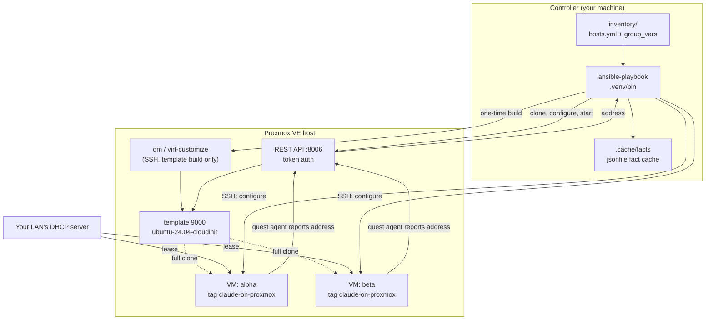
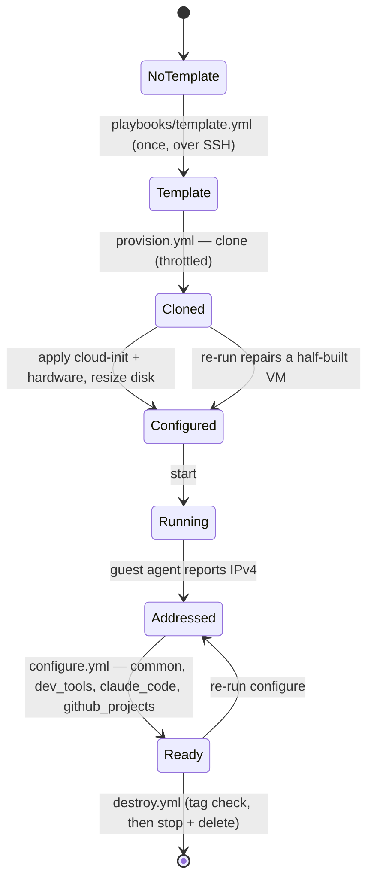
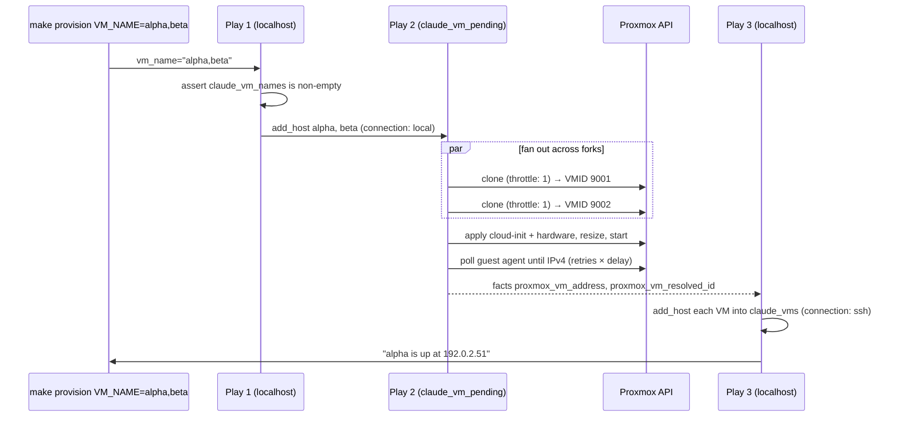

# Architecture

How `claude-on-proxmox` is built and why. `README.md` is the user manual, `CONTRIBUTING.md` the
workflow, `SECURITY.md` the threat model; this document is the technical reference behind all
three, and the source of truth when they disagree.

**Contents**

1. [Purpose and scope](#1-purpose-and-scope)
2. [System overview](#2-system-overview)
3. [The identity model](#3-the-identity-model)
4. [Lifecycle and control flow](#4-lifecycle-and-control-flow)
5. [Roles](#5-roles)
6. [Variable architecture](#6-variable-architecture)
7. [Custom code](#7-custom-code)
8. [Convergence and idempotence](#8-convergence-and-idempotence)
9. [Failure modes](#9-failure-modes)
10. [Security model](#10-security-model)
11. [Testing architecture](#11-testing-architecture)
12. [CI](#12-ci)
13. [Toolchain](#13-toolchain)
14. [File map](#14-file-map)
15. [Open design questions](#15-open-design-questions)

---

## 1. Purpose and scope

Create Ubuntu VMs on a Proxmox VE host and configure them as Claude Code development machines.
One command provisions a fleet; another configures it; a third tears it down.

**In scope:** cloning VMs from a cloud-init template, cloud-init user/key/network setup, discovering
VMs by tag, installing an OS baseline plus developer tooling, installing Claude Code, cloning a
GitHub account's repositories, and deleting VMs safely.

**Deliberately out of scope:** managing the Proxmox host itself beyond building one template,
networking (no bridges, no VLANs, no static IP management), storage provisioning, clustering,
backups, and anything that would require the project to remember state between runs.

**The governing constraint** is that the repository must be shareable. Nothing environment-specific
is ever committed. The Proxmox host's address is the single address anyone supplies, and it lives in
a git-ignored file. Every VM address is assigned by DHCP and read back at runtime.

---

## 2. System overview

Three actors:

| Actor | What runs there | How it is reached |
|---|---|---|
| **Controller** | Ansible, all Proxmox API calls, the fact cache | local |
| **Proxmox host** | `qm`, `virt-customize`, the template build | SSH (`playbooks/template.yml` only) |
| **VMs** | everything `configure.yml` installs | SSH, at a DHCP address discovered at runtime |



The controller never learns a VM's address from configuration. It learns it from the QEMU guest
agent, which is the only portable way to read a DHCP-assigned address out of a VM that Proxmox
itself did not assign.

---

## 3. The identity model

Three separate identifiers, each owned by a different party. Understanding who owns what explains
most of the design.

| Identifier | Assigned by | Used for | Persisted? |
|---|---|---|---|
| **Name** (`alpha`) | the user, via `VM_NAME` | the key for every lookup | in Proxmox, as the VM name |
| **VMID** (`9001`) | Proxmox (`/cluster/nextid`) | API calls after the clone | in Proxmox |
| **Address** (`192.0.2.51`) | the LAN's DHCP server | SSH | nowhere — re-read every run |
| **Tag** (`claude-on-proxmox`) | this project | ownership and discovery | in Proxmox, on the VM |

**The name is the primary key.** The role looks a VM up by name and clones only when no VM of that
name exists, which is what makes re-running a no-op. `proxmox_vm_id` exists but is rarely needed.

**Proxmox is the register.** Nothing is tracked locally. A VM deleted in the Proxmox UI simply stops
appearing; there is no local state file to reconcile, and no drift to repair.

**The tag is the ownership interlock.** Proxmox permits any VM to carry any name, so a name alone
cannot prove this project created something. Every VM the `proxmox_vm` role creates is tagged
`claude-on-proxmox` (`claude_vm_tag`). Discovery selects on it, and deletion *refuses* a VM without
it. Matching is anchored via `claude_vm_tag_pattern` so `claude-on-proxmox-staging` and
`not-claude-on-proxmox` are never claimed:

```
(^|[;,])claude\-on\-proxmox([;,]|$)
```

Both separators are handled because Proxmox stores tags `;`-joined, lowercased, deduplicated and
sorted, while `proxmox_kvm` *sends* them comma-joined and some versions echo that form back.

---

## 4. Lifecycle and control flow



### 4.1 `playbooks/template.yml` — one-time

`hosts: proxmox`, over SSH, because importing a disk image needs `qm` on the node. Runs
`roles/proxmox_template`. Not part of `site.yml`, since it is the only thing needing SSH to the
hypervisor.

### 4.2 `playbooks/provision.yml` — three plays

Three plays rather than one loop, because the work parallelises. Most of the per-VM time is a
multi-minute wait for the guest agent to report a DHCP address, and every VM is already booting on
the hypervisor concurrently. A loop over `include_role` would watch them one at a time.



**Play 1 — register.** Splits `vm_name` on commas into `claude_vm_names`, asserts the list is
non-empty (with no names the next play has no hosts and provisioning would report success having
done nothing), and turns each name into a placeholder host in `claude_vm_pending` with
`ansible_connection: local`. Nothing ever connects to those placeholders — every task in the role is
delegated to the controller.

**Play 2 — create.** Runs `roles/proxmox_vm` across the placeholders so Ansible fans out over
`forks` (default 10). `proxmox_vm_name` defaults to `inventory_hostname`, which is the VM name.

**Play 3 — publish and report.** Loops `add_host` from localhost over the facts the role left
behind, putting every VM into `claude_vms` with its address, and prints each one.

> **Why publishing lives here and not in the role.** `add_host` sets `BYPASS_HOST_LOOP`, so it runs
> **once per task** regardless of how many hosts the play has. A copy inside the role publishes only
> the first VM of a fleet. Looping it from a single-host play is the only form that scales. The
> `ansible_connection: ssh` is explicit because `add_host` *updates* a host of the same name rather
> than replacing it, and the placeholders from play 1 are `connection: local`.

### 4.3 `playbooks/discover.yml`

Finds VMs by tag so `configure.yml` works standalone, not only straight after provisioning.

1. `proxmox_vm_info type=qemu` → `claude_vm_all` (every QEMU VM).
2. `claude_vm_tagged` (a lazily-evaluated group var) filters to the tagged ones.
3. `claude_vm_discovered` narrows to `VM_NAME` when given, else the whole fleet.
4. Assert no duplicate names — Proxmox permits them, and the second `add_host` would silently
   overwrite the first, so `make configure` would report success having touched one of two,
   unpredictably.
5. Per VM, read `config: current` + `network: true`. A VM whose agent is not up is skipped; a 401/403
   is **fatal**, because it applies to every VM and swallowing it means configuring zero hosts and
   exiting 0, which looks like success.
6. `add_host` each VM whose MAC *and* address could be read. Without a MAC the VM is skipped rather
   than guessed at — an address picked without one could be a bridge the guest grew later (`docker0`).
7. If nothing was found, print a diagnostic that distinguishes "no tagged VMs exist", "tagged VMs
   exist but none match `VM_NAME`", and "tagged VMs exist but none reported an address yet".

### 4.4 `playbooks/configure.yml`

```yaml
import_playbook: discover.yml   when: claude_vm_discovery | default(true) | bool
hosts: claude_vms, become: true
  pre_tasks: wait_for_connection (300s), cloud-init status --wait (rc 0 or 2)
  roles: common → dev_tools → claude_code → github_projects   (each tagged)
```

`claude_vm_discovery: false` skips the Proxmox API entirely, which is how the Vagrant and Molecule
paths configure a host that is already in a static inventory. `cloud-init status --wait` accepts
exit code 2 ("done with recoverable errors").

> `when:` on an `import_playbook` propagates to the imported plays' tasks rather than skipping the
> import. Equivalent here because `discover.yml` is a single play.

### 4.5 `playbooks/destroy.yml`

Destructive, so it is the most defensive playbook in the repository.

1. `vars_prompt` confirmation with `default: "no"` — a run with no terminal (CI, cron, a nested
   playbook) takes the default rather than hanging, so the default must be the safe answer.
2. List every VM, filter by tag, and assert every requested name exists. Asking for a name that was
   never created is an error naming the VMs that *do* exist, not a confirmation prompt followed by
   silence.
3. Loop `include_role` with `proxmox_vm_state: absent`, which applies the ownership check per VM.
4. `make destroy` also removes `.cache/facts`.

### 4.6 `site.yml`

`provision.yml` then `configure.yml`. The template build is excluded because it needs SSH to the
hypervisor.

---

## 5. Roles

Six roles, no inter-role dependencies (`dependencies: []` everywhere). Ordering is the playbook's
job.

### 5.1 `proxmox_template` — build the golden image

Runs on the PVE node over SSH. Everything is guarded by a `qm config <vmid>` probe: a VMID that
exists but is *not* the finished template (a half-built earlier run, or an unrelated VM) is an error
rather than something to skip silently.

1. Download the Ubuntu Noble cloud image, checksummed against Ubuntu's published `SHA256SUMS`.
2. If `proxmox_template_install_guest_agent` (default true), **copy** the image and run
   `virt-customize --install qemu-guest-agent --truncate /etc/machine-id` on the copy. The pristine
   download is left untouched so `get_url` stays idempotent.
3. `qm create` with `--agent enabled=1`, virtio NIC, virtio-scsi, serial console.
4. `qm set --scsi0 <storage>:0,import-from=...,discard=on`, then add the cloud-init drive and boot order.
5. `qm template`.

Two non-obvious details, both load-bearing:

- **`dhcpcd-base` is installed alongside `libguestfs-tools`.** It is not pulled in on Proxmox 9, and
  without it the libguestfs appliance cannot DHCP, so `--install` fails with
  `Temporary failure resolving 'deb.debian.org'`.
- **`--truncate /etc/machine-id`.** Clones sharing a machine-id send the same DHCP client identifier
  and can be handed the same lease.

### 5.2 `proxmox_vm` — the core role

The only role that talks to the Proxmox API. All API parameters come from `module_defaults` on the
`group/community.proxmox.proxmox` action group, and the whole block is `delegate_to: localhost`.

**`tasks/main.yml`** — four validation asserts, split by condition on purpose (a single catch-all
message once sent someone with a mistyped VM name off to check their API token): connection
settings, VM name, login credentials, VM ID. `proxmox_vm_state` is *not* asserted here because
`meta/argument_specs.yml` declares its `choices`, validated before the first task runs. Then: look
the VM up by name, refuse a duplicated name, record existence, and branch to `present.yml` or the
ownership check plus `absent.yml`.

**`tasks/present.yml`**

| Step | Notes |
|---|---|
| Clone | `throttle: 1` — see [§9](#9-failure-modes) |
| Assert `clone is changed` | a VMID collision returns `changed=False` and the *template's* VMID |
| Record VMID | `when: not proxmox_vm_exists` |
| Apply hardware + cloud-init | `when: proxmox_vm_needs_configuration` |
| Resize root disk | same condition; `proxmox_disk` no-ops when already the right size |
| Start | `when: needs_configuration or proxmox_vm_start_existing` |
| Read NIC config | `until` non-empty, `retries`/`delay`, `failed_when: false`, then a dedicated assert |
| Wait for guest agent | polls until an IPv4 appears, breaking early on 401/403 |
| Record address | `set_fact proxmox_vm_address`, then assert non-empty |

The read-then-assert pairs exist so a failure reports *what to fix* ("check the API token holds
VM.Monitor") instead of Ansible's generic retry timeout.

**`tasks/absent.yml`** — read the config and agent address *while the VM still exists*, stop, delete
with `force: true` (which also covers a VM restarted between the two calls), then two housekeeping
steps: remove the address from `known_hosts`, and delete the VM's jsonfile fact cache entry. Both
matter because names and DHCP leases are reused: a stale host key produces
`HOST KEY VERIFICATION FAILED` with no hint why, and a stale fact cache describes hardware that no
longer exists. If no address could be determined, a warning says so and names the `ssh-keygen -R`
fix.

**`vars/main.yml`** holds five lazily-evaluated internals — see [§6.3](#63-computed-internals).

### 5.3 `common` — OS baseline

apt cache refresh → optional safe upgrade → baseline packages (~26, including `qemu-guest-agent`
and `python3-debian`) → timezone → hostname → user, groups and passwordless sudo → authorised keys
→ sshd hardening → `~/.local/bin` on PATH for login shells → enable services.

Notable choices:

- **Timezone via `/etc/localtime` + `/etc/timezone`**, not `community.general.timezone`, so it also
  works in containers with no `timedatectl`/dbus.
- **Every toggle is a pair of tasks** (`Grant`/`Revoke` sudo, `Harden`/`Remove` sshd). `template` has
  no `state: absent`, so this is the idiom for a reversible setting.
- **`validate:` on both templates** — `visudo -cf` and `sshd -t -f`, so a bad render cannot lock
  anyone out. `sshd -t` needs `/run/sshd`, which is created first because it does not exist in a
  fresh container.
- **`lock_timeout: 600`** on every apt call: fresh cloud images run `unattended-upgrades` right after
  first boot, and the module's 60-second default is not enough.
- Host-level settings are skipped under `common_container_virt_types`.

### 5.4 `dev_tools` — developer tooling

Feature-toggled: Node.js (NodeSource), Docker Engine, GitHub CLI, uv. Each apt-repository task
follows the same shape:

```yaml
deb822_repository:
  signed_by: "{{ lookup('ansible.builtin.file', 'docker.asc') }}"   # vendored, not downloaded
register: dev_tools_docker_repo
apt: { update_cache: "{{ dev_tools_docker_repo.changed }}" }        # refresh only when it changed
```

**Signing keys are vendored** in `roles/dev_tools/files/`, so a swapped download endpoint cannot
supply its own key. **uv is pinned by version and SHA-256 per architecture**, with the digests stored
in `defaults/main.yml` rather than fetched alongside the archive, so a compromised release endpoint
cannot swap both. Node.js is apt-pinned to NodeSource over the distro package.

### 5.5 `claude_code` — install Claude Code

`getent` resolves the target user's home (tilde expansion for another user is not reliable), then one
of two install paths:

- **native** (default): probe `claude --version`; install when missing, or when `claude_code_version`
  is an exact `x.y.z` that differs from what is installed. `stable`/`latest` self-update, so they are
  installed once and never reinstalled. The installer script is downloaded to a tempfile in a `block`
  with an `always:` cleanup.
- **npm**: `community.general.npm` with `version: omit` for `stable`/`latest`.

`settings.yml` merges managed settings *over* whatever is on the VM (`slurp` with
`failed_when: false`, `combine(recursive=True)`), so a user's own edits to `~/.claude/settings.json`
survive a re-run. Every task there is `no_log: true` because the API key passes through.

#### Remote Control

`claude_code_remote_control: true` additionally runs a Remote Control server on the VM, so its
session appears at claude.ai/code and in the Claude mobile app while executing on the VM.

This is the one part of the project that cannot be fully automated, and the reason is a hard
constraint rather than an omission. Anthropic supports exactly one credential for Remote Control:

| Credential | Model requests | Remote Control |
|---|---|---|
| `ANTHROPIC_API_KEY` | yes | **no** — "API keys are not supported" |
| `claude setup-token` → `CLAUDE_CODE_OAUTH_TOKEN` | yes | **no** — "can only make model requests, so it can't establish Remote Control sessions" |
| Interactive claude.ai `/login` (Pro, Max, Team, Enterprise) | yes | **yes** |

So the role automates everything around the login and stops at it:

1. **Assert the API key is empty.** `ANTHROPIC_API_KEY` outranks the subscription login in Claude
   Code's credential precedence, so configuring both would silently authenticate as the API account
   and Remote Control would refuse to start. The two are mutually exclusive and the role says so.
2. **Assert nothing disables the feature.** `DISABLE_TELEMETRY`, `DO_NOT_TRACK`,
   `CLAUDE_CODE_DISABLE_NONESSENTIAL_TRAFFIC` and `DISABLE_GROWTHBOOK` each switch off the
   feature-flag evaluation Remote Control depends on; `ANTHROPIC_BASE_URL` pointing anywhere but
   `api.anthropic.com` disables it outright.
3. **Resolve the binary.** `command -v claude` under a login shell, because the native installer and
   npm put it in different places and systemd does not read a login shell.
4. **Pre-accept the two dialogs** that would stall a headless server — first-run onboarding and
   workspace trust for the session directory — by seeding `~/.claude.json`. Written only when a flag
   is actually missing: Claude Code owns that file and rewrites it constantly, so reasserting the
   whole document every run would report `changed` forever.
5. **Check `claude auth status`**, which returns JSON carrying `loggedIn`, `authMethod` and
   `subscriptionType`. Eligibility is `loggedIn && authMethod == "claude.ai"`. The *plan* is
   deliberately not checked — hard-coding the strings for Pro/Max/Team/Enterprise would turn a new
   plan name into a false refusal, and an ineligible plan already fails at service start with
   Claude Code's own message.
6. **Install the unit either way**, then start it only when eligible. When it is not, the service is
   left disabled and stopped rather than crash-looping, and the play prints the exact command to run.

The unit runs as the VM user from `~/projects`, with `Restart=on-failure` bounded by
`StartLimitBurst=5` in 300 seconds — an expired login cannot be renewed without a browser, so
unbounded restarts would spin forever instead of surfacing in `systemctl status`.

`playbooks/claude_login.yml` (`make claude-login`) discovers the VMs, reports which are already
signed in, and prints `ssh -t dev@<address> "claude auth login"` for the rest. Over SSH the browser
cannot reach Claude Code's local callback server, so it shows a code to paste back — that is the
documented flow, not a workaround.

### 5.6 `github_projects` — clone an account's repositories

Validates the username, resolves the target directory, calls the custom `github_repos` module,
filters (`exclude`, then `include` if non-empty, never-pushed repos dropped as `empty`), reports the
selection, and clones.

For SSH clones it first fetches GitHub's published host keys from `<api_url>/meta` and seeds them
into the user's `known_hosts`, avoiding trust-on-first-use. `update_existing` defaults to **false**
so a re-run never disturbs local work.

---

## 6. Variable architecture

### 6.1 Layers

```
role defaults/main.yml                    lowest — every variable has one
  └─ inventory/group_vars/all/defaults.yml    committed, shared, safe
       └─ inventory/group_vars/all/local.yml  git-ignored, your environment
            └─ inventory/group_vars/all/vault.yml  git-ignored, ansible-vault
                 └─ host_vars / play vars
                      └─ role vars/main.yml     internals; deliberately un-overridable
                           └─ -e extra vars      highest
```

Files in `group_vars/all/` load alphabetically, which is why the layering is
`defaults.yml` < `local.yml` < `vault.yml`.

### 6.2 The wiring file

Roles are self-contained and prefix their variables (`common_user`, `dev_tools_node_major`) —
ansible-lint's `var-naming[no-role-prefix]` enforces this. `inventory/group_vars/all/defaults.yml`
wires project-level names onto role-level ones so a user sets one variable and it flows everywhere:

```yaml
vm_user: dev
common_user:            "{{ vm_user }}"
dev_tools_user:         "{{ vm_user }}"
claude_code_user:       "{{ vm_user }}"
github_projects_user:   "{{ vm_user }}"
proxmox_vm_user:        "{{ vm_user }}"
```

`proxmox_api_host` itself defaults to the `ansible_host` of the first host in the `proxmox` group,
so the address is written once, in `inventory/hosts.yml`.

`vm_ssh_public_keys` reads `~/.ssh/id_ed25519.pub` with `errors='ignore'`, so someone whose key is
RSA or ECDSA gets the role's actionable "set vm_ssh_public_keys" message rather than a bare
"could not locate file" from the lookup, which Jinja evaluates first.

### 6.3 Computed internals

`roles/proxmox_vm/vars/main.yml` holds five expressions that read registers set by tasks. They are
**vars, not facts**, and that is load-bearing:

| Var | Derived from | Purpose |
|---|---|---|
| `proxmox_vm_found_mac` | `proxmox_vm_config` | the VM's own NIC MAC, `""` if unreadable |
| `proxmox_vm_reported_address` | `proxmox_vm_net` + the MAC | the agent's IPv4 for that NIC |
| `proxmox_vm_found_tags` | `proxmox_vm_lookup` | tags as a list, `;`/`,` both handled |
| `proxmox_vm_needs_configuration` | existence + tags + `force_update` | see [§8](#8-convergence-and-idempotence) |
| `proxmox_vm_forget_address` | reported address, else `hostvars[...].ansible_host` | which host key to drop |
| `proxmox_vm_fact_cache` | `lookup('config', 'CACHE_PLUGIN*')` | which cache file to evict |

> **Do not convert these to `set_fact`.** `destroy.yml` runs the role in a loop, and a `set_fact`
> survives an iteration that skips it — so a fact would hand VM #1's MAC to VM #2. A skipped
> *register* is overwritten with a skip result; a skipped `set_fact` is not. Lazy vars re-evaluate
> against whatever the registers hold right now.

`claude_vm_tagged` in `inventory/group_vars/all/defaults.yml` follows the same pattern: it reads the
`claude_vm_all` register, so any play using it must register that first, and is meant to fail loudly
if it has not. It is defined once so `discover.yml` and `destroy.yml` cannot drift on what "ours"
means.

The three facts that *are* facts — `proxmox_vm_address`, `proxmox_vm_resolved_id`,
`proxmox_vm_exists` — must be, because `provision.yml`'s third play reads them through `hostvars`,
and role vars are not visible outside the role.

---

## 7. Custom code

### 7.1 `filter_plugins/proxmox.py`

Two filters for reading Proxmox API output.

**`net_mac(net_config, default=_RAISE)`** — extracts the MAC from `virtio=BC:24:11:0E:72:04,bridge=vmbr0`.
It **raises by default**, because a caller about to act on one specific VM wants to know its NIC is
unreadable. Passing a default turns that into a skip, which is what a caller sweeping the whole fleet
wants: one odd VM (NIC removed in the UI, `net1` but no `net0`) should not abort discovery for
everyone else. The sentinel object distinguishes "no default given" from "default is `''`".

**`guest_ipv4(interfaces, mac=None)`** — reads `network-get-interfaces` output. With a MAC, only the
matching interface is considered, which is what keeps bridges the guest grew later (`docker0`,
`podman`, `virbr0`) from being picked up on a re-run. Loopback and link-local are never returned.
Returns `None` when nothing is available yet, so a `until:` loop can poll on it.

Covered by 22 unit tests in `tests/unit/test_filters.py`.

### 7.2 `roles/github_projects/library/github_repos.py`

An Ansible module listing a GitHub account's repositories, following `Link`-header pagination. With a
token belonging to the queried user it uses the authenticated endpoint and includes private repos;
otherwise it falls back to the public listing. Returns a compact, sorted list carrying `name`,
`full_name`, `clone_url`, `ssh_url`, `default_branch`, `fork`, `archived`, `private` and `empty`
(never pushed to, so nothing to clone).

Written against the managed VM's Python — `ruff` targets `py310`, not the controller's 3.12+.
Covered by 26 unit tests in `tests/unit/test_github_repos.py`.

---

## 8. Convergence and idempotence

Idempotence is enforced mechanically: Molecule's idempotence stage re-runs converge and fails on any
task reporting `changed`.

**Existence is not convergence.** A run that dies between the clone and the settings call leaves a VM
that exists but has no cloud-init user, no SSH keys, no agent and no tag. Keying the settings call off
existence would skip the repair forever and then wait five minutes for an agent that was never
enabled. So:

```jinja
proxmox_vm_needs_configuration =
     (not proxmox_vm_exists)
  or (proxmox_vm_force_update | bool)
  or (proxmox_vm_tags[0] not in proxmox_vm_found_tags)
```

The tag is written by the same API call that writes the cloud-init settings, so its absence is the
marker that the call did not complete. A half-built VM is repaired; a finished one is left alone.

Three related switches:

| Variable | Default | Why |
|---|---|---|
| `proxmox_vm_force_update` | `false` | Proxmox reports *every* update as a change, which would break idempotence |
| `proxmox_vm_start_existing` | `false` | re-running provision must not boot a VM someone shut down deliberately |
| `github_projects_update_existing` | `false` | a re-run must not disturb local work in a checkout |

A VM this run created or repaired is always started, regardless of `start_existing`.

---

## 9. Failure modes

The traps this design exists to avoid, and how each is handled.

**VMID allocation is racy.** Proxmox offers no atomic reservation: `proxmox_kvm` asks
`/cluster/nextid` and then clones, so two concurrent clones are handed the same free ID and the
second fails with `Unable to clone vm beta`. Only the clone task carries `throttle: 1`; the rest of
the role, including the multi-minute agent wait, still runs for every VM at once — which is where the
time actually goes.

**A VMID collision reports success.** `proxmox_kvm` returns `changed=False` and the *clone source's*
VMID. Taking that on trust points every subsequent task at the template and reconfigures it. Hence
the explicit `assert: proxmox_vm_clone is changed`.

**`add_host` bypasses the play's host loop.** Covered in [§4.2](#42-playbooksprovisionyml--three-plays).

**A 403 looks like a slow boot.** A token without `VM.Monitor` fails the agent poll identically to a
VM that has not finished booting. Waiting the full `60 × 5s` to say so helps nobody, so the `until:`
breaks early on `40[13]|[Pp]ermission|[Aa]uthentication`. In `discover.yml` the same condition is
`failed_when`, because there it applies to every VM and swallowing it means exiting 0 with zero hosts.

**Duplicate names.** Proxmox permits them. The role refuses to act on one; `discover.yml` refuses to
continue with one, because the second `add_host` would silently overwrite the first.

**Tag substring matching.** An unanchored search for `claude-on-proxmox` also claims
`claude-on-proxmox-staging`. See [§3](#3-the-identity-model).

**Stale host keys and stale facts.** Both handled in `absent.yml`; see [§5.2](#52-proxmox_vm--the-core-role).

**`/cluster/resources` lags.** `proxmox_vm_info` builds its answer from it, and it can trail a VM
cloned moments ago, returning nothing. The post-start config read retries rather than indexing into
an empty list.

**`-e key=value` splits on whitespace.** `VM_NAME="alpha beta"` silently provisioned half the fleet.
The Makefile passes JSON (`-e '{"vm_name": "..."}'`) so the value arrives whole and reaches the name
check, which explains the problem.

**`vars_prompt` hangs without a terminal.** Every prompt has a `default:`, and it is the safe answer.

**An API key silently outranks the subscription login.** Claude Code's credential precedence puts
`ANTHROPIC_API_KEY` above the `/login` credential, so a VM configured with both would authenticate
as the API account — and Remote Control, which needs the subscription login, would refuse to start
with no obvious cause. The role asserts the two are never configured together.

**There is deliberately no `LIMIT`.** `--limit` is applied before the plays run, and these VMs only
enter the inventory once discovery has found them, so it could never match. `VM_NAME` is the
selector for every target.

---

## 10. Security model

`SECURITY.md` is the policy; this is the mechanism.

**Authentication** is API tokens only, never a password. The README documents creating a dedicated,
VM-scoped `ansible@pve` token rather than using `root@pam`. `validate_certs` defaults to `false`
because Proxmox ships a self-signed certificate, and the README covers trusting the PVE CA to turn it
on.

**Secrets** live in `inventory/group_vars/all/vault.yml`, ansible-vault encrypted. `make vault-check`
runs before every playbook target and refuses to run while that file is plaintext. Any variable that
can hold a secret carries `no_log: true` in its `argument_specs`.

**Nothing environment-specific is committed.** Two independent mechanisms:

- `.gitignore` stops the accident.
- `tests/check_no_local_files.sh` stops `git add -f`. It runs in CI and as the first step of the lint
  job, and blocks `inventory/hosts.yml`, `inventory/proxmox.yml`, any `.ini` under `inventory/`,
  `local|vault|secret*.yml` in any `group_vars/`, any `host_vars/` at the inventory or repo root,
  root-level `vault.yml`/`local.yml`, `.vault_pass*` and `.env*`. `.example` files are exempt.
  `tests/unit/test_tracked_files.py` asserts both directions — every blocked path is also gitignored,
  and no test fixture trips it.

**Supply chain.** Galaxy collections are pinned to exact versions (a range means every run silently
picks up the latest publish, and made the CI cache key useless since it hashes the file). pre-commit
hooks are pinned to commit SHAs, not tags, because a tag can be moved. apt signing keys are vendored
in-repo. The uv release is pinned by version *and* per-architecture SHA-256, stored separately from
the download. The Molecule base image is pinned by digest, with an unpinned weekly canary.

**Secret scanning.** gitleaks runs as a pre-commit hook and, separately, in CI. The hook form
(`gitleaks git --pre-commit --staged`) scans the git index, which in a CI checkout equals HEAD — i.e.
an empty diff that always passes. CI therefore scans the working tree in `dir` mode, scoped by
`.gitleaks.toml` to exclude local build artifacts.

**On the VM:** key-only SSH via a validated sshd drop-in, root password login disabled, passwordless
sudo for the dev user (a deliberate trade-off, recorded in SECURITY.md), and GitHub's host keys
pre-seeded from the API rather than trusted on first use. `ansible.cfg` uses
`StrictHostKeyChecking=accept-new`: trust a freshly provisioned VM on first contact, but still refuse
if a known host's key changes later.

---

## 11. Testing architecture

Three tiers. **No test ever talks to a real Proxmox, a real GitHub, or a real hypervisor.**

### 11.1 Unit — `make unit`

pytest over `tests/unit/`: 87 tests — 22 for the filters, 26 for `github_repos`, 39 for the
tracked-file guard.

### 11.2 Role scenarios — `make molecule MOLECULE_ROLES="..."`

One Molecule scenario per role at `roles/<name>/molecule/default/`, inheriting driver and platform
from `.config/molecule/config.yml`. Each runs create → prepare → converge → **idempotence** →
side_effect → verify → destroy.

`proxmox_vm`'s scenario is the interesting one: it runs against the fake PVE API and asserts the VMID
came from Proxmox (9001, the next free one) and that the address came from the VM's own NIC —
`192.0.2.51`, not `172.17.0.1`, which would mean the docker bridge was picked up.

### 11.3 Playbook scenarios — `make molecule-scenario SCENARIO=...`

| Scenario | What it proves |
|---|---|
| `provision` | `provision.yml` + `discover.yml` end to end against the fake API, for a two-VM fleet |
| `configure` | `configure.yml` end to end against a container standing in for a provisioned VM |

Both symlink the **real** `inventory/group_vars/all/defaults.yml` into the scenario inventory, so the
actual variable wiring is exercised rather than a copy. Test overrides live in `host_vars/`. The
symlink must survive checkout — clone the repo, do not download a zip.

The `provision` scenario is deliberately adversarial. Before discovery runs, `verify.yml` seeds three
VMs that must **not** be claimed:

| Fixture | Why |
|---|---|
| `stranger`, tagged `claude-on-proxmox-staging` | a substring match would configure someone else's staging box |
| `bystander`, tagged `not-claude-on-proxmox` | the same trap from the other side |
| `nonic`, correctly tagged but with no `net0` | `net_mac` used to raise and take discovery down for the fleet |

All three are *running*, and their agents answer — so the only thing keeping them out is the filter
under test. It then re-applies the tag filter to the live `/cluster/resources` list, because the
scenario sets `vm_name`, which narrows the list *before* the filter is reached: without that direct
assertion the tag filter could be deleted entirely and every other assertion would still pass.
Finally it reads the fake API's request log and asserts each VM was cloned exactly once, by name, and
that the role asked `/cluster/nextid` rather than inventing VMIDs.

### 11.4 The fakes — `tests/molecule/`

| Fake | Stands in for | Notes |
|---|---|---|
| `fake_pve_api.py` | the Proxmox REST API | TLS, token auth, stateful VMs, a guest agent, a request log |
| `fake_qm.sh` | `qm` on the PVE node | stateful, one config file per VMID, logs every invocation |
| `fake_virt_customize.sh` | `virt-customize` | so `proxmox_template` runs in a container |
| `fake_github_api.py` | the GitHub REST API | serves local bare repositories |

`fake_pve_api.py` is deliberately faithful where fidelity has caught bugs:

- `normalise_tags()` stores tags the way PVE does — `;`-joined, lowercased, deduplicated, sorted.
  Echoing the request back verbatim hid the `,` vs `;` difference from every test.
- The agent refuses `AGENT_READY_AFTER = 2` polls **per VM**. With a single global counter the first
  VM absorbed every refusal and the second's first poll succeeded, so a fleet never exercised the
  wait loop more than once.
- `agent_interfaces()` always reports `lo`, a `docker0` bridge the role must ignore, and the VM's own
  `eth0` — which is what makes the "address came from the right NIC" assertion meaningful.
- 401 replies have an empty body, as the real API does.

### 11.5 Vagrant — `make vagrant-up`

`configure.yml` against a real VirtualBox VM, with `claude_vm_discovery: false`. Not part of CI.

### 11.6 Which scenarios need the network

`common`, `dev_tools`, `claude_code`, `github_projects` and the `configure` scenario install packages
inside the container and need working Docker DNS. `proxmox_vm`, `proxmox_template` and the
`provision` scenario talk only to local fakes and still run offline.

---

## 12. CI

`.github/workflows/ci.yml`, on push to `main`/`master`, on every pull request, and weekly
(`17 6 * * 1`).

| Job | Contents |
|---|---|
| `lint` | tracked-file guard → `make lint` → `make syntax` → `make unit` → pre-commit (minus the linters already run) → gitleaks in `dir` mode |
| `dependency-review` | PRs only, fails on moderate severity |
| `molecule` | matrix over all six roles, `needs: lint` |
| `playbooks` | matrix over the `configure` and `provision` scenarios, `needs: lint` |
| `canary` | schedule/dispatch only, runs `configure` against the **unpinned** Ubuntu image; allowed to fail — that failure is the notification |

`.github/actions/setup` is a composite action installing Python 3.12, restoring the pip and Galaxy
caches, and running `make deps`. The Galaxy cache key hashes `requirements.yml`, which is only correct
because those versions are exact.

**No job uses a secret**, so the full suite runs on pull requests from forks. Keep it that way.
`make test` is deliberately a superset of the CI gate, pre-commit included.

---

## 13. Toolchain

Everything is pinned in `requirements.txt` and lives in `.venv`. Use `make`, or `.venv/bin/<tool>`.

```
ansible-core 2.21.3    ansible-lint 26.8.0    molecule 26.8.0    yamllint 1.38.0
pytest 9.1.1           ruff 0.16.6            pre-commit 4.5.1   proxmoxer 2.3.0
```

Collections: `community.proxmox 2.0.0`, `community.general 12.4.0`, `community.docker 5.3.0`,
`ansible.posix 2.1.0`.

> **Molecule resolves `ansible-playbook` from `PATH` and only appends the virtualenv**, so `.venv/bin`
> must be **prepended** or a different ansible-core is silently used. The `molecule` targets do this;
> a hand-rolled `molecule test` does not.

`ansible.cfg` sets the directory inventory, `roles_path`, the local `filter_plugins`, YAML callback
output, `profile_tasks`, a jsonfile fact cache at `.cache/facts` (1h), `forks = 10`, pipelining, and
`StrictHostKeyChecking=accept-new`. `inventory_ignore_extensions` *extends* Ansible's defaults —
setting `inventory_ignore_patterns` instead would discard them and a stray `hosts.yml.bak` would be
parsed as inventory.

Linting is the ansible-lint **production** profile with `args`, `empty-string-compare`,
`no-log-password`, `no-same-owner`, `name[prefix]` and `yaml` additionally enabled.

---

## 14. File map

```
ansible.cfg                       inventory dir, fact cache, accept-new host keys, forks
site.yml                          provision + configure
CLAUDE.md                         agent-facing operating rules
ARCHITECTURE.md                   this document

playbooks/
  template.yml                    one-time: build the cloud-init template (SSH to PVE)
  provision.yml                   three plays: register → create in parallel → publish
  discover.yml                    find VMs by tag, resolve addresses via the guest agent
  configure.yml                   discover, then common → dev_tools → claude_code → github_projects
  destroy.yml                     confirm, verify ownership, stop and delete

roles/
  proxmox_template/               qm + virt-customize on the PVE node
  proxmox_vm/                     the Proxmox API role (tasks/{main,present,absent}.yml, vars/main.yml)
  common/                         OS baseline, user, sudo, keys, sshd hardening
  dev_tools/                      Node.js, Docker, gh, uv  (files/*.asc are vendored signing keys)
  claude_code/                    native or npm install, settings.json merge
  github_projects/                library/github_repos.py + clone loop

filter_plugins/proxmox.py         net_mac, guest_ipv4
inventory/
  hosts.yml.example               the only address anyone supplies
  controller.yml                  localhost, so it picks up group_vars/all
  group_vars/all/defaults.yml     shared defaults + the role wiring
  group_vars/all/{local,vault}.yml.example

tests/
  check_no_local_files.sh         tracked-file guard (also runs in CI)
  unit/                           pytest: filters, github_repos, the guard itself
  molecule/                       shared fakes: PVE API, qm, virt-customize, GitHub API
molecule/
  provision/                      provision.yml + discover.yml against the fake API
  configure/                      configure.yml end to end in a container
.config/molecule/config.yml       driver, pinned image, shared provisioner settings
.github/                          CI, release, the composite setup action, Dependabot
```

---

## 15. Open design questions

**Replace `discover.yml` with the `community.proxmox` inventory plugin.** The plugin does the same
job in roughly 200 fewer lines and can read a vault-encrypted token through a lookup. It is not used
because an inventory plugin has no access to `group_vars`, so `proxmox_api_host` would have to be
declared a second time outside the one file a user edits; it runs on *every* `ansible*` invocation;
and when the API is unreachable it degrades to "no hosts matched" rather than failing loudly. The two
reasons that once forced the issue — a broken `LIMIT` interface and an over-matching tag filter — have
both been fixed independently, so this is now a pure design choice. The header of `discover.yml`
records the same trade-offs.

**`common_enabled_services` and the `kvm` check.** `Enable services` starts a service only when
`ansible_virtualization_type == 'kvm'`, which is right for `qemu-guest-agent` (the only entry today)
but means anything a user adds to the list is enabled-but-not-started on Vagrant or bare metal. Two
tasks earlier, the hostname guard uses the more general `not in common_container_virt_types`.
