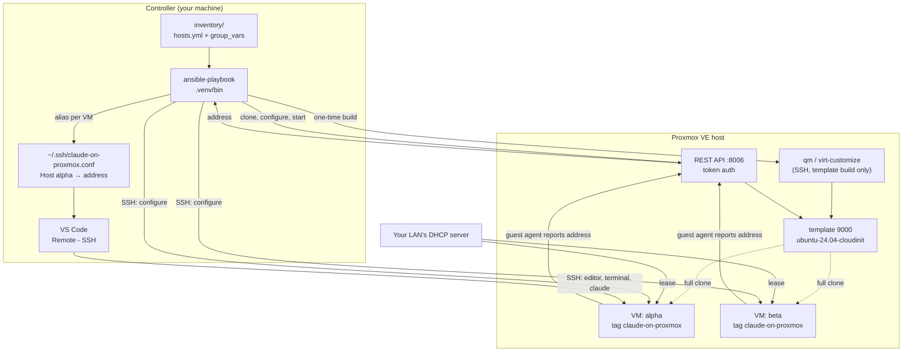
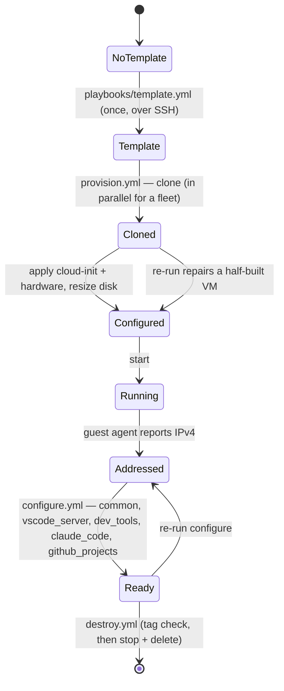
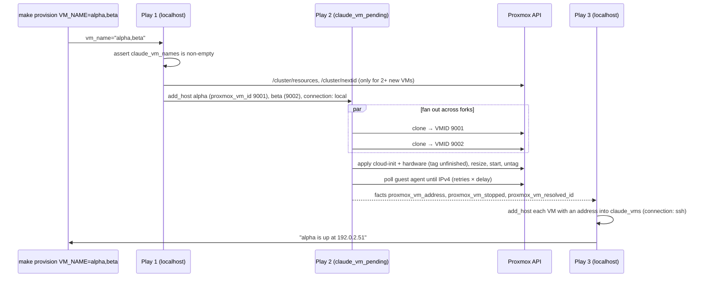

# Architecture

How `claude-on-proxmox` is built and why. `README.md` is the user manual, `CONTRIBUTING.md` the
workflow, `SECURITY.md` the threat model; this document is the technical reference behind all
three, and the source of truth when they disagree.

**Contents**

1. [Purpose and scope](#1-purpose-and-scope)
2. [System overview](#2-system-overview)
3. [The identity model](#3-the-identity-model)
4. [Lifecycle and control flow](#4-lifecycle-and-control-flow)
5. [Roles](#5-roles)
6. [Variable architecture](#6-variable-architecture)
7. [Custom code](#7-custom-code)
8. [Convergence and idempotence](#8-convergence-and-idempotence)
9. [Failure modes](#9-failure-modes)
10. [Security model](#10-security-model)
11. [Testing architecture](#11-testing-architecture)
12. [CI](#12-ci)
13. [Toolchain](#13-toolchain)
14. [File map](#14-file-map)
15. [Open design questions](#15-open-design-questions)

---

## 1. Purpose and scope

Create Ubuntu VMs on a Proxmox VE host and configure them as Claude Code development machines.
One command provisions a fleet; another configures it; a third tears it down.

**In scope:** cloning VMs from a cloud-init template, cloud-init user/key/network setup, discovering
VMs by tag, installing an OS baseline plus developer tooling, installing Claude Code, cloning a
GitHub account's repositories, and deleting VMs safely.

**Deliberately out of scope:** managing the Proxmox host itself beyond building one template,
networking (no bridges, no VLANs, no static IP management), storage provisioning, clustering,
backups, and anything that would require the project to remember state between runs.

**The governing constraint** is that the repository must be shareable. Nothing environment-specific
is ever committed. The Proxmox host's address is the single address anyone supplies, and it lives in
a git-ignored file. Every VM address is assigned by DHCP and read back at runtime.

---

## 2. System overview

Three actors:

| Actor | What runs there | How it is reached |
|---|---|---|
| **Controller** | Ansible, all Proxmox API calls | local |
| **Proxmox host** | `qm`, `virt-customize`, the template build | SSH (`playbooks/template.yml` only) |
| **VMs** | everything `configure.yml` installs | SSH, at a DHCP address discovered at runtime |
| **VS Code**, on the controller | the editor window; its server, terminal and extensions run on the VM | SSH, through an alias this project keeps in `~/.ssh/claude-on-proxmox.conf` |


```mermaid
flowchart TB
    subgraph C["Controller (your machine)"]
        A["ansible-playbook<br/>.venv/bin"]
        INV["inventory/<br/>hosts.yml + group_vars"]
        SSHC["~/.ssh/claude-on-proxmox.conf<br/>Host alpha → address"]
        VSC["VS Code<br/>Remote - SSH"]
    end
    subgraph P["Proxmox VE host"]
        API["REST API :8006<br/>token auth"]
        QM["qm / virt-customize<br/>(SSH, template build only)"]
        TPL["template 9000<br/>ubuntu-24.04-cloudinit"]
        VM1["VM: alpha<br/>tag claude-on-proxmox"]
        VM2["VM: beta<br/>tag claude-on-proxmox"]
    end
    DHCP["Your LAN's DHCP server"]

    A -->|"clone, configure, start"| API
    A -->|"one-time build"| QM
    QM --> TPL
    API --> TPL
    TPL -.->|"full clone"| VM1
    TPL -.->|"full clone"| VM2
    DHCP -->|"lease"| VM1
    DHCP -->|"lease"| VM2
    VM1 -->|"guest agent reports address"| API
    VM2 -->|"guest agent reports address"| API
    API -->|"address"| A
    A -->|"SSH: configure"| VM1
    A -->|"SSH: configure"| VM2
    INV --> A
    A -->|"alias per VM"| SSHC
    SSHC --> VSC
    VSC -->|"SSH: editor, terminal, claude"| VM1
```

The controller never learns a VM's address from configuration. It learns it from the QEMU guest
agent, which is the only portable way to read a DHCP-assigned address out of a VM that Proxmox
itself did not assign.

---

## 3. The identity model

Three separate identifiers, each owned by a different party. Understanding who owns what explains
most of the design.

| Identifier | Assigned by | Used for | Persisted? |
|---|---|---|---|
| **Name** (`alpha`) | the user, via `VM_NAME` | the key for every lookup | in Proxmox, as the VM name |
| **VMID** (`9001`) | Proxmox (`/cluster/nextid`; a fleet's are numbered from it once, in `provision.yml`) | API calls after the clone | in Proxmox |
| **Address** (`192.0.2.51`) | the LAN's DHCP server | SSH | nowhere — re-read every run |
| **Tag** (`claude-on-proxmox`) | this project | ownership and discovery | in Proxmox, on the VM |

**The name is the primary key.** The role looks a VM up by name and clones only when no VM of that
name exists, which is what makes re-running a no-op. `proxmox_vm_id` exists but is rarely needed.

**Proxmox is the register.** Nothing is tracked locally. A VM deleted in the Proxmox UI simply stops
appearing; there is no local state file to reconcile, and no drift to repair.

**The tag is the ownership interlock.** Proxmox permits any VM to carry any name, so a name alone
cannot prove this project created something. Every VM the `proxmox_vm` role creates is tagged
`claude-on-proxmox` (`claude_vm_tag`). Discovery selects on it, and both deletion and provisioning
*refuse* an existing VM without it — configuring someone else's VM would rewrite it and stamp the tag,
after which deletion would accept it too. Matching is anchored via `claude_vm_tag_pattern` so
`claude-on-proxmox-staging` and `not-claude-on-proxmox` are never claimed:

```
(?i)(^|[;,])claude\-on\-proxmox([;,]|$)
```

Both separators are handled because Proxmox stores tags `;`-joined, lowercased, deduplicated and
sorted, while `proxmox_kvm` *sends* them comma-joined and some versions echo that form back. The
lowercasing is why the match is case-insensitive and the role lowercases both what it sends and what
it compares: a `claude_vm_tag` of `Claude-On-Proxmox` is stamped on a VM as `claude-on-proxmox`, and
matched as typed it would never find the VMs it had created.

---

## 4. Lifecycle and control flow


```mermaid
stateDiagram-v2
    [*] --> NoTemplate
    NoTemplate --> Template: playbooks/template.yml (once, over SSH)
    Template --> Cloned: provision.yml — clone (in parallel for a fleet)
    Cloned --> Configured: apply cloud-init + hardware, resize disk
    Configured --> Running: start
    Running --> Addressed: guest agent reports IPv4
    Addressed --> Ready: configure.yml — common, vscode_server, dev_tools, claude_code, github_projects
    Ready --> Addressed: re-run configure
    Ready --> [*]: destroy.yml (tag check, then stop + delete)
    Cloned --> Configured: re-run repairs a half-built VM
```

### 4.1 `playbooks/template.yml` — one-time

`hosts: proxmox`, over SSH, because importing a disk image needs `qm` on the node. Runs
`roles/proxmox_template`. `deploy.yml` runs it only when the template is missing, deciding that
through the API, and the import-level `when:` is what keeps a run that does not need to build it
from opening an SSH connection to the hypervisor: it skips the implicit fact gather along with every
task ([§4.7](#47-deployyml)). The play's `gather_facts: false` only saves a pointless gather on the
run that does build.

### 4.2 `playbooks/provision.yml` — three plays

Three plays rather than one loop, because the work parallelises. Most of the per-VM time is a
multi-minute wait for the guest agent to report a DHCP address, and the VMs are already booting on
the hypervisor, up to `forks` at a time. A loop over `include_role` would watch them one at a time.


```mermaid
sequenceDiagram
    participant U as make provision VM_NAME=alpha,beta
    participant P1 as Play 1 (localhost)
    participant P2 as Play 2 (claude_vm_pending)
    participant PX as Proxmox API
    participant P3 as Play 3 (localhost)

    U->>P1: vm_name="alpha,beta"
    P1->>P1: assert claude_vm_names is non-empty
    P1->>PX: /cluster/resources, /cluster/nextid (only for 2+ new VMs)
    P1->>P2: add_host alpha (proxmox_vm_id 9001), beta (9002), connection: local
    par fan out across forks
        P2->>PX: clone → VMID 9001
        P2->>PX: clone → VMID 9002
    end
    P2->>PX: apply cloud-init + hardware (tag unfinished), resize, start, untag
    P2->>PX: poll guest agent until IPv4 (retries × delay)
    P2-->>P3: facts proxmox_vm_address, proxmox_vm_stopped, proxmox_vm_resolved_id
    P3->>P3: add_host each VM with an address into claude_vms (connection: ssh)
    P3->>U: "alpha is up at 192.0.2.51"
```

**Play 1 — register.** Splits `vm_name` on commas into `claude_vm_names`, asserts the list is
non-empty (with no names the next play has no hosts and provisioning would report success having
done nothing), and turns each name into a placeholder host in `claude_vm_pending` with
`ansible_connection: local`. Nothing ever connects to those placeholders — every task in the role is
delegated to the controller.

When two or more of the names have no VM yet, play 1 also gives each of those a VMID, as the
placeholder's `proxmox_vm_id`, so play 2 can clone them concurrently (see [§9](#9-failure-modes)).
The numbering starts at `/cluster/nextid`, so it begins where Proxmox would and honours the
datacenter's `next-id` range, and skips every VMID `/cluster/resources` lists, containers included.
Both are read with `uri` rather than `proxmox_vm_info`, which also queries every node holding a guest
and fails if one is offline. The header and CA path they send are `proxmox_api_headers` and
`proxmox_api_ca_path` from `group_vars/all`, shared with every other raw read; the token travels in
that header, so those tasks are `no_log`, and an assert after each reports a failed listing or
VMID read by status and reason, without it. A `proxmox_vm_id` set for the whole run is refused here
when more than one VM is new, before anything is created. A single new VM is left to Proxmox, as
before.

**Play 2 — create.** Runs `roles/proxmox_vm` across the placeholders so Ansible fans out over
`forks` (20 in `ansible.cfg`; a larger fleet proceeds in waves of that size, or pass
`ANSIBLE_ARGS="-f N"`). `proxmox_vm_name` defaults to `inventory_hostname`, which is the VM name.
An existing, configured VM that is stopped is left stopped unless `proxmox_vm_start_existing` is
set, and the role does not wait for its agent: it sets `proxmox_vm_stopped` and an empty
`proxmox_vm_address` and prints why. A VM an earlier run left unfinished is finished and started
whatever its status (see [§8](#8-convergence-and-idempotence)).

**Play 3 — publish and report.** Loops `add_host` from localhost over the facts the role left
behind, putting each VM that has an address into `claude_vms`, and prints one line per requested
VM: its address, that it was left stopped, or that it failed. The loop is over the names asked for,
not the hosts that survived play 2, so the address is read with a default — a VM whose run failed
has no fact at all, and reading it bare crashed the play, skipping configuration for every VM that
did come up.

> **Why publishing lives here and not in the role.** `add_host` sets `BYPASS_HOST_LOOP`, so it runs
> **once per task** regardless of how many hosts the play has. A copy inside the role publishes only
> the first VM of a fleet. Looping it from a single-host play is the only form that scales. The
> `ansible_connection: ssh` is explicit because `add_host` *updates* a host of the same name rather
> than replacing it, and the placeholders from play 1 are `connection: local`.

### 4.3 `playbooks/discover.yml`

Finds VMs by tag so `configure.yml` works standalone, not only straight after provisioning.

1. `playbooks/tasks/cluster_vms.yml` → `claude_vm_all`: every VM in the cluster, straight from
   `/cluster/resources` with `ansible.builtin.uri`. Not an unfiltered `proxmox_vm_info`, which goes on
   to ask every node that owns a VM for its VM list and fails outright if one node does not answer —
   so a single powered-off node in a cluster broke discovery for VMs on all the others. The listing
   already carries `name`, `vmid`, `node`, `status`, `template` and `tags`. The task is `no_log`
   because the request carries the token, so a second task asserts on the status and shows only it
   and the reason. `REQUESTS_CA_BUNDLE` is passed as `ca_path`, so the README's certificate recipe
   covers this request too. It is `check_mode: false`: `uri` does not support check mode, so under
   `make check` it would skip itself and discovery would find nothing.
2. `claude_vm_tagged` (a lazily-evaluated group var) filters to the tagged QEMU VMs. Proxmox omits
   `tags` for an untagged guest, hence its `selectattr('tags', 'defined')`.
3. `claude_vm_discovered` is `claude_vm_requested`: narrowed to `VM_NAME` when given, else the whole
   fleet. `list.yml` narrows through the same group var.
4. Assert no duplicate names — Proxmox permits them, and the second `add_host` would silently
   overwrite the first, so `make configure` would report success having touched one of two,
   unpredictably.
5. Per VM, `proxmox_vm_info vmid=...` with `config: current` + `network: true`, which asks only that
   VM's node. A VM that is stopped, whose agent is not up or whose node is down is skipped; a refused
   token is **fatal**, because it applies to every VM and swallowing it means configuring zero hosts
   and exiting 0, which looks like success. "Refused" is the `proxmox_access_denied` filter (§7.1),
   shared with `list.yml` and the role's agent wait.
6. `add_host` each VM for which `guest_address(proxmox_nic)` (§7.1) returns an address. Without the
   MAC of that NIC the VM is skipped rather than guessed at — an address picked without one could be
   a bridge the guest grew later (`docker0`).
7. If nothing was found, print a diagnostic that distinguishes "no tagged VMs exist", "tagged VMs
   exist but none match `VM_NAME`", and "tagged VMs exist but none reported an address yet" (stopped,
   still booting, or a token without guest-agent access).

Without `VM_NAME`, step 3 keeps every tagged VM, so `make configure`, `make check` and
`make claude-login` are fleet-wide by default.

### 4.4 `playbooks/configure.yml`

```yaml
import_playbook: discover.yml   when: claude_vm_discovery | default(true) | bool
hosts: claude_vms, become: true
  pre_tasks: wait_for_connection (300s), cloud-init status --wait (rc 0 or 2)
  roles: common → vscode_server → dev_tools → claude_code → github_projects   (each tagged)
```

```yaml
  post_tasks (tagged always): getent vm_user → claude_vm_workspace fact
hosts: localhost  (tagged always)
  collect {name, address, user, vmid, workspace} for every claude_vms host that has the fact
  import tasks/ssh_config.yml  state: present   → the connect line per VM
```

`claude_vm_discovery: false` skips the Proxmox API entirely, which is how the Vagrant and Molecule
paths configure a host that is already in a static inventory, and how `deploy.yml` configures only
the hosts provisioning published (§4.7). `cloud-init status --wait` accepts exit code 2 ("done with
recoverable errors").

The third play keeps an SSH alias per VM on the controller (§4.8), so `ssh alpha` and VS Code's host
picker follow the address DHCP gave it. It reads a fact the second play set *last*: `claude_vm_workspace`,
`vm_projects_dir` or `~/projects` of `vm_user` as `getent` resolves it on the VM. A host that failed a
role never reaches that `post_task`, so it never gets an alias; and the workspace is the VM user's real
home rather than a guess, because Ansible's own `user_dir` fact is the *connecting* user's home, which is
root's under Molecule. Both the lookup and the play are tagged `always`, like discovery, so a
`make configure TAGS=claude_code` after a lease moved still refreshes the alias. `claude_ssh_config: false`
keeps the whole project out of `~/.ssh`.

> `when:` on an `import_playbook` propagates to the imported plays' tasks rather than skipping the
> import. Equivalent here because `discover.yml` is a single play.

### 4.5 `playbooks/destroy.yml` — two plays

Destructive, so it is the most defensive playbook in the repository. It has `provision.yml`'s shape,
for the same reason: stopping a VM and removing its disks takes time, and none of it depends on
another VM. It used to loop `include_role` on localhost, which deleted the VMs one at a time: against
the fake, at 10 forks, 5 VMs took 40 s that way and take 14 s now, and 20 VMs 168 s
against 41 s.

**Play 1 — confirm and check (localhost).**

1. `vars_prompt` confirmation with `default: "no"` — a run with no terminal (CI, cron, a nested
   playbook) takes the default rather than hanging, so the default must be the safe answer.
2. List the cluster (§4.3, step 1) and assert every requested name exists among this project's VMs.
   Asking for a name that was never created is an error naming the VMs that *do* exist, not a
   confirmation prompt followed by silence. A name that exists but is untagged gets a hint: tag it,
   or set `proxmox_vm_allow_untagged_delete`, which widens the check to untagged VMs — the role's
   escape hatch for VMs created before this project tagged its own, which this check used to make
   unreachable. A template is never admitted, with the flag or without.
3. `add_host` each name into `claude_vm_doomed` with `ansible_connection: local`, as provisioning's
   placeholders are.

**Play 2 — delete (`claude_vm_doomed`).** The role with `proxmox_vm_state: absent` across the
placeholders, fanning out over `forks`; it looks each VM up again and applies the ownership check per
VM. Its `known_hosts` task is `throttle: 1`, because parallel deletes would otherwise each rewrite
the same file and restore a key another had just removed.

**Play 3 — forget the alias (localhost).** `tasks/ssh_config.yml` with `state: absent` for the VMs
that are actually gone: play 2 ends with a `post_tasks` fact, `claude_vm_deleted`, which a host that
failed in the role never reaches, and play 3 removes only the aliases of hosts that have it. A VM
whose deletion failed - a stop that timed out, protection on, an API error - keeps its alias,
because it is still there to connect to, and the run names it. A run refused in play 1 never
reaches play 3; removing a block that is not there is a no-op. A localhost play rather than a task in the role, so the role stays free of the controller's
ssh config and the one writer per run needs no throttle.

### 4.6 `playbooks/list.yml`

Read-only. Lists the cluster and narrows it exactly as `discover.yml` does (§4.3, steps 1–3), then
asks each VM for its config and agent report, by VMID, and prints a table.

It differs from `discover.yml` in one deliberate way: it lists a VM **whether or not** its agent
answers. Discovery skips an unaddressable VM because it cannot configure it; a listing that hid one
would be answering a different question than the one asked. A VM with no address shows `-`, and a
footnote names it.

Rows are built once, in `claude_list_rows` — each VM's cluster-listing entry combined with the
address `guest_address(proxmox_nic)` finds for it — so the table and that footnote cannot disagree
about which VMs have an address.

### 4.7 `deploy.yml`

The whole thing: template, provision, configure. A first play on localhost asks the API whether a
template named `proxmox_template_name` exists and records it; the template play is imported with a
`when:` on that fact. The lookup is `proxmox_vm_info name=...`, so only the node holding that name is
asked for its VM list — unfiltered, one node that is down failed the run before anything was built.

`configure.yml` is imported with `vars: {claude_vm_discovery: false}`, so it configures exactly the
hosts provisioning's play 3 published. Running discovery there would disagree with provisioning
about what an omitted `VM_NAME` means: `claude_vm_names` falls back to `claude_vm_default_name`, but
discovery tests `vm_name is defined` and falls back to the whole fleet, so a bare `make deploy`
created the default VM and then configured every tagged VM. It also repeated, one VM at a time, the
lookups provisioning had just made. Import `vars:` are play vars of every imported play, including
the nested `discover.yml` import, whose `when:` therefore sees them.

What keeps that from opening an SSH connection is the import-level `when:` itself. A `when:` on an
`import_playbook` propagates to every task of the imported play, and ansible-core counts the
implicit fact-gathering task as one of them - so a false condition skips the gather along with
everything else, and nothing connects, whether or not the play would have gathered facts.
`template.yml` still sets `gather_facts: false`, but only because the role reads no `ansible_*`
facts: that saves a pointless gather on the *first* run, when the play does execute. It is not what
prevents the SSH connection on later runs.

The result is that only the first run needs root SSH to the hypervisor. Every later `make deploy`
is API and VM traffic only.

---

### 4.8 `playbooks/ssh_config.yml` and `playbooks/tasks/ssh_config.yml`

The aliases are the one thing this project writes on the controller besides `known_hosts`, and
every writer goes through one task file so the block format cannot drift. Inputs: a list of
`{name, address, user, workspace?}` and a state; `workspace` only feeds the connect line, and only
`configure`, which has read it on the VM, passes it. The managed file,
`~/.ssh/claude-on-proxmox.conf` (`claude_ssh_config_file`), holds one `blockinfile` block per VM,
with what ssh reads and nothing else - no state of this project's is kept in a user's ssh config:

```
# BEGIN claude-on-proxmox: alpha
Host alpha
    HostName 192.0.2.51          ← or alpha.<claude_ssh_host_domain>
    User dev
    ServerAliveInterval 30       ← claude_ssh_options, verbatim
# END claude-on-proxmox: alpha
```

The user's own `~/.ssh/config` gets exactly one line, `Include <managed file>`, inserted at the top
(`lineinfile`, `insertbefore: BOF`): an `Include` below a `Host` block is scoped to that block. It is
added only when the managed file is not reached already, which is ssh's to say rather than a regex's:
a line in a spelling ssh accepts for the same file - the absolute path, `~/...`, `${HOME}/...`, or
the bare name for a file in `~/.ssh` - counts only if `ssh -G -F <user config> <first VM>` comes
back with the `HostName` the managed file just gave that VM. `${HOME}/...` is expanded only from
OpenSSH 9.9 on (Ubuntu 24.04 ships 9.6, which reads it as a literal path), `$HOME/...` never, and
an `Include` inside a `Host` block reaches only that host; each of those includes nothing, and the
line is added above it. An existing line is left exactly as written, not rewritten into this form.
The file's mode is set only when this task creates it. The `Include` is never
removed, since that would mean editing the user's file on destroy, and an `Include` of a missing
file is harmless. Nothing else in `~/.ssh` is ever edited.

Three guards, in order: the alias is the VM's name, so a `Host` line in the user's config that
already names it is refused by file and line (the managed file is included first, so writing would
silently override the user's entry); every write is validated by the real client, `ssh -G -F %s
<alias>`, so a malformed option fails the task instead of every `ssh` on the machine; and a block is
only ever written for a VM the caller found by its tag.

`ssh_config.yml` (`make ssh-config`) is the fleet-wide resync: the cluster listing, the addresses
(§4.3 steps 1 and 4), `present` for every tagged VM with an address, keeping a workspace an earlier
configure recorded, then pruning through `ssh_config_prune` (§7.1). Pruning removes blocks, never
VMs, and only a block whose name no VM in the cluster carries any more. A name an untagged VM
carries is left alone and reported, as `destroy.yml` refuses such a VM. While any tagged VM is listed
without a name, which is what a node that is down looks like (§4.3), nothing is pruned, because any
block could be that VM's. With `VM_NAME`, only those VMs are refreshed and nothing is pruned. Two
tagged VMs of one name are refused as discovery refuses them: an alias of that name would point at
one at random.

### 4.9 `playbooks/code.yml`

`make code VM_NAME=alpha [PROJECT=discord-music-bot]`: the alias step for one VM, then the one step
no other playbook does, launching the editor. In order:

1. Refuse anything but one name, and a `vm_project` (`PROJECT`) that is not one GitHub repository
   name - up to 100 ASCII letters, digits, `.`, `-`, `_`, and not `.` or `..` - so nothing outside
   the projects directory, or nested in it, can be opened. The Makefile's `project-name-check` refuses
   the same before a shell sees the value; this is for a direct `ansible-playbook` run.
2. Find the VM by tag, naming an untagged VM of that name as not this project's; ask its agent for
   the address. Settle where it is reached exactly as the alias's `HostName` does - the address, or
   `<name>.<claude_ssh_host_domain>` - so this run and VS Code connect to the same target, and refuse
   a VM that is not running, whatever its name resolves to.
3. Add it to `claude_vms` with `add_host`, the way configure reaches it: Ansible's own connection and
   `accept-new`, not the user's ssh config, and the group's connection variables from the inventory
   (a key, a port) apply as they do to `make configure`.
4. Read the VM user's home on the VM with `getent`, delegated over SSH, unless `vm_projects_dir`
   says where the code is. Nothing is guessed on the controller, and nothing is read back out of the
   alias: the workspace is `vm_projects_dir` or `<home>/projects`.
5. Refuse a `vm_projects_dir` that is not absolute (VS Code is handed it as written, from this
   machine, so `~` would not expand) and, with the terminal on, a `vscode_workspaces_dir` that is
   not absolute, is the projects directory (its files would sit among the repositories), or is the
   folder being opened (`PROJECT=.claude-on-proxmox`). Each names the variable it is about.
6. Refresh the alias, then look for the folder to open - the workspace, or `<workspace>/<project>` -
   with `stat` on the VM. Read-only. Unreachable, missing and not-a-folder are each their own
   message: a missing project lists what the workspace holds and, for a name that differs only in
   case, suggests the right one, since the VM's paths are case-sensitive; a missing workspace means a
   VM never configured, and says to run `make configure`. These are there so a typo is said in the
   terminal, not in a VS Code window opened on a folder that does not exist.
7. Check `code` is on `PATH`, and install `ms-vscode-remote.remote-ssh` if `code --list-extensions`
   lacks it.
8. With `vscode_claude_terminal` (the default), write a workspace file on the VM and open that:
   `code --remote ssh-remote+alpha <workspaces>/project/<project>.code-workspace`, or
   `<workspaces>/<workspace's name>.code-workspace` for the whole directory, where `<workspaces>` is
   `vscode_workspaces_dir` or `<workspace>/.claude-on-proxmox`. One project's file is in `project/`
   so a repository that shares the workspace's name cannot collide with the whole directory's. Off,
   it opens the folder itself and writes nothing.
9. Say what VS Code will do, from the user's VS Code settings, read and never written: looked for
   where VS Code would put them (`VSCODE_APPDATA`, `XDG_CONFIG_HOME`, stock VS Code's place on macOS
   and Linux, the snap, the flatpak), and said as not found, not readable or not parsable when they
   are, since "unset" would promise a question that may not come; VS Code asks once per workspace,
   in a notification that goes quiet after a moment, so the message names *Tasks: Manage Automatic
   Tasks* as well.

**The workspace file** is built as data and written with `to_nice_json`, so no path breaks its JSON;
`copy` leaves an unchanged file alone. It names the folder by absolute path, hides its own directory
from the explorer of the window that shows it, and holds one task, `Claude`: a `process` task,
`/bin/bash -lc <script> make-code <not installed> <signed in>`, `cwd` the folder, `runOptions.runOn:
folderOpen`, presented in a dedicated, focused terminal. A login shell, because VS Code starts task
shells non-login and `claude` is on the login `PATH` only (`make claude-login` uses `bash -lc` for
the same reason). The script checks `claude` is installed, runs `claude auth login` when
`claude auth status` fails, and then `exec claude --continue` - the folder's latest conversation, or
a new one, because a task terminal does not survive a window reload, after which the task runs
again; its two messages arrive as arguments, never as script text, and
`tests/unit/test_code_session.py` runs it against a stand-in `claude`. `${workspaceFolder}`
is not used: in a task that belongs to a workspace file rather than a folder it is ambiguous.

Sign-in is not scripted, because it cannot be: it is a browser flow. VS Code Server puts its
`browser.sh` helper in `BROWSER` for every terminal it starts, which opens the URL on the client,
and `claude` shows the URL as well and accepts a pasted code. A fresh login leaves Remote Control's
unit stopped (§5.5); the terminal names `make configure VM_NAME=<name> TAGS=claude_code`, which starts
it through the role's own eligibility checks, rather than starting it itself.

**What VS Code decides, and what this does not touch.** VS Code runs a `folderOpen` task only in a
trusted window, and only once automatic tasks are allowed:

| Gate | Where VS Code keeps it | What `code.yml` does |
|---|---|---|
| Workspace Trust | client-side, by URI, per remote authority; a trusted folder covers its children. A workspace file is trusted when its folders *and* the file itself are | Puts the files under the projects directory, so trusting that directory once covers every project and every file. Says so. |
| `task.allowAutomaticTasks` | an application setting in the default profile's `settings.json`; unset, VS Code asks once and *Allow* writes `"on"`; only a user-set `"off"` silences both question and task | Reads it with the `vscode_setting` filter (JSONC: comments, trailing commas, flat or nested key) and says which question to expect, or that the terminal will not start. Never writes it. |

Both are the user's own security decisions, so there is no `security.workspace.trust.enabled:
false`, no `terminal.integrated.allowInUntrustedWorkspace`, no written setting and no user-level
`folderOpen` task, which would fire in every workspace they open. Checked against VS Code 1.140's
source: trust is computed over the folders plus the workspace file's own URI, automatic tasks
include a workspace file's tasks, and a path ending in `.code-workspace` given to `--remote` opens as a
workspace. The defaults moved twice in 2026 (1.109, 1.126); CI cannot watch the user's editor, so a
manual run of `make code` is the check when they move again.

The workspace file is the one thing written on the VM, last, as the VM user, so every refusal above
leaves the VM as it was; a workspace directory that already exists keeps its mode, since
`vscode_workspaces_dir` may name one of the user's own. `tests/unit/test_code_session.py` holds
every task in `code.yml` to an allowlist - read-only here, or delegated to the VM - and the
`provision` scenario checks the settings file it planted is byte-for-byte untouched after every
run. `PROJECT=.claude-on-proxmox`, which names the files' own directory, is refused. Cloud-init placed the key, so a VM that was provisioned but never configured still
opens once it has a workspace, and its terminal says to run `make configure`.

## 5. Roles

Seven roles, no inter-role dependencies (`dependencies: []` everywhere). Ordering is the playbook's
job.

### 5.1 `proxmox_template` — build the golden image

Runs on the PVE node over SSH. Everything is guarded by a `qm config <vmid>` probe: a VMID that
exists but is *not* the finished template (a half-built earlier run, or an unrelated VM) is an error
rather than something to skip silently. The probe reads this node's configs only, so a VMID held by
a sibling node looks free to it; before building, the role reads pmxcfs's cluster-wide
`/etc/pve/.vmlist` and refuses a VMID another node holds, naming that node. Without that the build
ran to `qm create` - after the download and `virt-customize` - and died there with
`VM 9000 already exists on node 'pve2'`.

1. Download the Ubuntu Noble cloud image, checksummed against Ubuntu's published `SHA256SUMS`, into
   `proxmox_template_image_dir` (`/var/lib/vz/claude-on-proxmox`, created `0755`). Not a content
   directory of the `local` storage: under `template/iso` Proxmox listed the image as an ISO.
2. If `proxmox_template_install_guest_agent` (default true), **copy** the image and run
   `virt-customize --install qemu-guest-agent --truncate /etc/machine-id` on the copy. The pristine
   download is left untouched so `get_url` stays idempotent.
3. `qm create` with `--agent enabled=1`, virtio NIC, virtio-scsi, serial console.
4. `qm set --scsi0 <storage>:0,import-from=...,discard=on`, then add the cloud-init drive and boot order.
5. `qm template`, then remove the customised copy: `import-from` has copied the disk into the
   storage, so it is derived data a rebuild makes again, and it was ~600 MB per node otherwise.
   The download stays. Without the guest agent the import path *is* the download, which is kept.

Two non-obvious details, both load-bearing:

- **`dhcpcd-base` is installed alongside `libguestfs-tools`.** It is not pulled in on Proxmox 9, and
  without it the libguestfs appliance cannot DHCP, so `--install` fails with
  `Temporary failure resolving 'deb.debian.org'`.
- **`--truncate /etc/machine-id`.** Clones sharing a machine-id send the same DHCP client identifier
  and can be handed the same lease.

### 5.2 `proxmox_vm` — the core role

The only role that talks to the Proxmox API. All API parameters come from `module_defaults` on the
`group/community.proxmox.proxmox` action group, and the whole block is `delegate_to: localhost`.

**`tasks/main.yml`** — four validation asserts, split by condition on purpose (a single catch-all
message once sent someone with a mistyped VM name off to check their API token): connection
settings, VM name, login credentials, VM ID. `proxmox_vm_state` is *not* asserted here because
`meta/argument_specs.yml` declares its `choices`, validated before the first task runs. Then: look
the VM up by name (with its config), refuse a duplicated name, record existence, then either refuse
an existing VM that is a template or lacks the tag and branch to `present.yml`, or run the ownership
check and `absent.yml`.

**`tasks/present.yml`**

| Step | Notes |
|---|---|
| Clone | `throttle: 1` only when Proxmox picks the VMID; a fleet's VMIDs are pre-assigned — see [§9](#9-failure-modes) |
| Assert `clone is changed` | a VMID collision returns `changed=False` and the *template's* VMID |
| Record VMID | `when: not proxmox_vm_exists` |
| Tag the new VM | its own call, straight after the clone — see [§8](#8-convergence-and-idempotence) |
| Apply hardware + cloud-init | `when: proxmox_vm_needs_configuration`; to `proxmox_vm_found_node`, the node the lookup found the VM on, as is every call after the clone — a migrated VM is no longer on `proxmox_vm_node` |
| Resize root disk | same condition; `proxmox_disk` no-ops when already the right size |
| Start | `when: needs_configuration or proxmox_vm_start_existing` |
| Mark finished | removes `claude-on-proxmox-unfinished`, which the settings call added — see [§8](#8-convergence-and-idempotence) |
| Read NIC config | only for a VM this run cloned: `until` non-empty, `retries`/`delay`, `failed_when: false`; an existing VM's config is the one the lookup fetched (`proxmox_vm_found_config`); then a dedicated assert |
| Wait for guest agent | polls until an IPv4 appears, breaking early on 401/403 |
| Record address | `set_fact proxmox_vm_address`, then assert non-empty |

The read-then-assert pairs exist so a failure reports *what to fix* (check that the API token holds
`VM.Monitor` on PVE 8, `VM.GuestAgent.Audit` on PVE 9) instead of Ansible's generic retry timeout.

**`tasks/absent.yml`** — ask the agent for the address *while the VM still exists* (the NIC's MAC comes
from the config the lookup already holds), stop, delete
with `force: true` (which also covers a VM restarted between the two calls) and
`destroy_unreferenced_disks: true` (a disk that still carries the VMID but that the configuration no
longer lists goes with the VM - these VMs are deleted often, and the tag check has already
established the VMID is this project's), then one housekeeping
step: remove the address from `known_hosts`. It matters because names and DHCP leases are reused,
and a stale host key produces `HOST KEY VERIFICATION FAILED` with no hint why. If no address could
be determined, a warning says so and names the `ssh-keygen -R` fix. There are no cached facts to
clear: the project has no fact cache ([§13](#13-toolchain)).

**`vars/main.yml`** holds the role's lazily-evaluated internals — see [§6.3](#63-computed-internals).

### 5.3 `common` — OS baseline

apt cache refresh → optional safe upgrade → baseline packages (~26, including `qemu-guest-agent`
and `python3-debian`) → timezone → hostname → user, groups and passwordless sudo → authorised keys
→ sshd hardening → `~/.local/bin` on PATH for login shells → enable services.

Notable choices:

- **Timezone via `/etc/localtime` + `/etc/timezone`**, not `community.general.timezone`, so it also
  works in containers with no `timedatectl`/dbus.
- **Every toggle is a pair of tasks** (`Grant`/`Revoke` sudo, `Harden`/`Remove` sshd). `template` has
  no `state: absent`, so this is the idiom for a reversible setting.
- **`validate:` on both templates** — `visudo -cf` and `sshd -t -f`, so a bad render cannot lock
  anyone out. `sshd -t` needs `/run/sshd`, which is created first because it does not exist in a
  fresh container.
- **`lock_timeout: 600`** on every apt call: fresh cloud images run `unattended-upgrades` right after
  first boot, and the module's 60-second default is not enough.
- Host-level settings are skipped under `common_container_virt_types`.

### 5.4 `dev_tools` — developer tooling

Feature-toggled: Node.js (NodeSource), Docker Engine, GitHub CLI, uv. Each apt-repository task
follows the same shape:

```yaml
deb822_repository:
  signed_by: "{{ lookup('ansible.builtin.file', 'docker.asc') }}"   # vendored, not downloaded
register: dev_tools_docker_repo
apt: { update_cache: "{{ dev_tools_docker_repo.changed }}" }        # refresh only when it changed
```

**Signing keys are vendored** in `roles/dev_tools/files/`, so a swapped download endpoint cannot
supply its own key. **uv is pinned by version and SHA-256 per architecture**, with the digests stored
in `defaults/main.yml` rather than fetched alongside the archive, so a compromised release endpoint
cannot swap both. Node.js is apt-pinned to NodeSource over the distro package.

### 5.5 `claude_code` — install Claude Code

`getent` resolves the target user's home (tilde expansion for another user is not reliable), then one
of two install paths:

- **native** (default): probe `claude --version`; install when missing, or when `claude_code_version`
  is an exact `x.y.z` that differs from what is installed. `stable`/`latest` self-update, so they are
  installed once and never reinstalled. The installer script is downloaded to a tempfile in a `block`
  with an `always:` cleanup.
- **npm**: `community.general.npm` with `version: omit` for `stable`/`latest`.

`settings.yml` merges managed settings *over* whatever is on the VM (`slurp` with
`failed_when: false`, `combine(recursive=True)`), so a user's own edits to `~/.claude/settings.json`
survive a re-run. Every task there is `no_log: true` because the API key passes through.

A merge can only add, so the role owns `env.ANTHROPIC_API_KEY` explicitly: when nothing managed
sets it, a key found on disk is stale and is removed, along with an `env` block it leaves empty.
Without that, clearing `claude_code_anthropic_api_key` changed nothing on the VM — the key an earlier
run wrote went on outranking the claude.ai login. The file is therefore read on every run, even with
nothing to manage, but parsed only when something is managed or its text contains the key — so with
nothing managed, a hand-broken file the role has no business with does not fail the run. Once
something is managed the file has to be parsed: an empty or whitespace-only one counts as `{}`, and
one that is not a JSON object fails in a `block` whose `rescue` names the file, rather than as a
`from_json` traceback hidden by `no_log`. A key set through `claude_code_settings.env` counts as
managed and stays.

#### Remote Control

`claude_code_remote_control: true` additionally runs a Remote Control server on the VM, so its
session appears at claude.ai/code and in the Claude mobile app while executing on the VM.

This is the one part of the project that cannot be fully automated, and the reason is a hard
constraint rather than an omission. Anthropic supports exactly one credential for Remote Control:

| Credential | Model requests | Remote Control |
|---|---|---|
| `ANTHROPIC_API_KEY` | yes | **no** — "API keys are not supported" |
| `claude setup-token` → `CLAUDE_CODE_OAUTH_TOKEN` | yes | **no** — "can only make model requests, so it can't establish Remote Control sessions" |
| Interactive claude.ai `/login` (Pro, Max, Team, Enterprise) | yes | **yes** |

It is on by default, and what happens is **derived from the credentials on the VM** rather than from
a switch — because no switch can create the one credential that works. `make configure` therefore
does one of three things, and a re-run is what activates it:

| Credentials found | Outcome |
|---|---|
| `ANTHROPIC_API_KEY` configured | Off, with a message. A key outranks the login |
| No key, no claude.ai login | Unit installed, service left stopped, the command to run is printed |
| No key, claude.ai login present | Service enabled and started; the session appears in the app |

The role automates everything around the login and stops at it:

1. **Turn it off when an API key is configured**, or when `claude_code_remote_control` is false.
   `ANTHROPIC_API_KEY` outranks the subscription login in Claude Code's credential precedence, so
   configuring both would silently authenticate as the API account and the server would refuse to
   start. This is not a failure: with Remote Control on by default, a VM on the API path is a normal
   configuration, not a mistake. Off is enforced rather than skipped. `main.yml` decides once
   (`claude_code_remote_control_wanted`) and either includes `remote_control.yml` or, if the unit
   file this role installs exists, stops and disables the service, removes the file and reloads
   systemd. Skipping alone left an earlier run's server taking sessions after the user opted out,
   and restarting on every boot with the key it could not use. Gating on the file keeps a VM that
   never had the unit untouched, and keeps check mode from asking `systemd_service` about a unit
   that does not exist.
2. **Read what `settings.json` disables.** The file is read back from disk after `settings.yml`
   wrote it, because that is what the server starts with and it keeps keys an earlier run left
   there. The `env` keys that block are the list `claude_code_remote_control_blocking_env` in
   `roles/claude_code/vars/main.yml`, which says why each does: the telemetry opt-outs switch off
   the feature-flag evaluation Remote Control depends on, and the token and provider switches route
   it to a credential that outranks the login. Checked separately, as the same file explains: an
   `apiKeyHelper`, which is a top-level settings key, and an `ANTHROPIC_BASE_URL` pointing anywhere
   but `api.anthropic.com`. The names found
   (`claude_code_remote_control_settings_blockers`, never the values) are part of eligibility in
   step 5, so a VM with one takes the same path as a VM with an unusable credential: unit installed,
   service stopped, the keys and the `claude_remote_control: false` switch named. It used to be an
   `assert`, which failed the host for a privacy setting its owner had chosen and kept
   `github_projects` from running behind it.
3. **Resolve the binary.** `command -v claude` under a login shell, because the native installer and
   npm put it in different places and systemd does not read a login shell.
4. **Pre-answer the three prompts** that would stall a headless server — first-run onboarding,
   workspace trust for the session directory, and Remote Control's one-time `Enable Remote Control?
   (y/n)` confirmation (`remoteDialogSeen`) — by seeding `~/.claude.json`. The confirmation is the
   one that matters most: it reads stdin, which systemd points at `/dev/null`, and anything but `y`
   exits 0, so without the seed the unit starts, prints the question to the journal and stops without
   ever registering. Enabling `claude_remote_control` is the user's answer to it. Written only when a
   flag is actually missing: Claude Code owns that file and rewrites it constantly, so reasserting the
   whole document every run would report `changed` forever.
5. **Check `claude auth status`**, which returns JSON carrying `loggedIn`, `authMethod`,
   `subscriptionType` and, when a key is in use, `apiKeySource`. Eligibility is
   `loggedIn && authMethod == "claude.ai" && !apiKeySource` and no blocker from step 2, defined once
   in `vars/main.yml` as vars that read the registered results, and shared with `make claude-login`
   (below), which reads the same two things over SSH. `authMethod` alone
   is not enough: it reads `claude.ai` whenever that login exists, even while an `ANTHROPIC_API_KEY`
   outranks it, and also for a Console login, whose key is reported as `/login managed key`. Only
   `apiKeySource` shows either. The *plan* is deliberately not checked — hard-coding the strings for
   Pro/Max/Team/Enterprise would turn a new plan name into a false refusal, and an ineligible plan
   already fails at service start with Claude Code's own message.
6. **Install the unit either way**, then start it only when eligible. When it is not, the service is
   left disabled and stopped rather than crash-looping, and the play prints what to do — the login
   command, or what is in the way and how to remove it. The tasks that enable, start or stop the
   service also require the unit file to exist. In a real run it always does; in check mode on a VM
   that never had it, `template` wrote nothing and `systemd_service` fails on a missing unit whether
   or not it is in check mode, so without that `make check` failed on every such VM.
7. **Confirm the server stayed up.** The service is restarted unless the unit file is unchanged and
   the service already active: a server waiting out its restart delay reports `activating`, which
   `started` treats as running. One `active` reading afterwards proves nothing, because `Type=simple` is active as soon
   as the process forks, before the server has tried to register. So the role records the main PID
   and `NRestarts` right after the start, waits 20 seconds, and requires the unit to be
   `active`/`running` with the same PID and count. An exit shows up either as `auto-restart` or as a
   new PID and a higher count. The count is compared, not required to be 0, because systemd keeps
   it for as long as the unit is not fully stopped, so a healthy server that once restarted through
   an outage has a non-zero count. The check runs only when the start task reports `changed`: a
   `started` against a server that was already running changes nothing, has nothing to prove, and
   would otherwise cost 20 seconds per batch of forks on every configure run of a live fleet. It is
   skipped in check mode too, where nothing was started. The role's Molecule side effect re-runs
   the role against the live server and asserts the PID and `NRestarts` are untouched, then changes
   the permission mode and asserts a new PID and the new unit text.

The unit runs as the VM user from `~/projects`, with `Restart=always`, `RestartSec=10`,
`RestartSteps=5` and `RestartMaxDelaySec=300`, and no start limit (`StartLimitIntervalSec=0`).
`always` because the server stops by itself for reasons that are not failures — server mode exits
after about ten minutes without a network — and `on-failure` restarts only an unclean exit. No start
limit because once reached it left the unit failed until someone intervened, after an outage or a
boot that raced the network. The delay backing off from 10 seconds to five minutes is what keeps an
expired login, which cannot be renewed without a browser, from spinning. `RestartSteps` needs
systemd 254; the VMs run Ubuntu 24.04 with 255.

`playbooks/claude_login.yml` (`make claude-login`) discovers the VMs and runs the role's `login` entry
point (`tasks_from: login`) on them. It reads `claude auth status` through a login shell and decides
from the same vars as step 5, so the two cannot disagree: when the playbook decided from `loggedIn`
alone, a VM signed in with a Console account, a `setup-token` token or an API key was told by each
command to run the other. It reports the VMs that are ready, and prints
`ssh -t dev@<address> "bash -lc 'claude auth login'"` for the rest, with what else is in the way. The
`bash -lc` is what puts `~/.local/bin` on `PATH`: `ssh` runs a command in a non-login shell, and
Ubuntu's `.bashrc` returns early for one. Over SSH the browser cannot reach Claude Code's local
callback server, so it shows a code to paste back — that is the documented flow, not a workaround.
`tests/unit/test_remote_control_playbooks.py` runs the playbook against canned `claude auth status`
output, and the check-mode path against a stand-in `systemctl`.

### 5.6 `github_projects` — clone an account's repositories

Validates the username, resolves the target directory, calls the custom `github_repos` module,
filters (`exclude`, then `include` if non-empty, never-pushed repos dropped as `empty`), reports the
selection, and clones.

For SSH clones it first fetches GitHub's published host keys from `<api_url>/meta` and seeds them
into the user's `known_hosts`, avoiding trust-on-first-use. `update_existing` defaults to **false**
so a re-run never disturbs local work.

### 5.7 `vscode_server` — what VS Code's Remote - SSH needs on the host

Runs right after `common`, which owns the user and sshd. VS Code's documented requirements for a
Remote - SSH host are bash, tar and curl or wget, a glibc x86_64 or aarch64 system, an sshd that
allows the port forward the VS Code Server is reached through, and an inotify limit large enough to
watch a workspace. The image and `common` give the first two; this role checks them, writes the other
two, and proves the sshd one.

- **A second drop-in, `20-vscode-server.conf`**, with `AllowTcpForwarding yes`,
  `AllowStreamLocalForwarding yes` and `ClientAliveInterval`/`CountMax`, validated with `sshd -t`.
  Two files, two owners: `10-` is `common`'s hardening, `20-` is this.
- **`sshd -T -C` for the editor's connection.** sshd keeps the first value it reads for a keyword,
  and a `Match` block sets its own for the connections it matches, so a drop-in sorted before `20-`,
  `sshd_config` itself or a `Match User dev` block can each silently override the file this role
  just wrote. The role reads where the editor will connect from out of Ansible's own
  `SSH_CONNECTION` (without `become`, which drops it), asks `sshd -T -C user=<vm_user>,host=,addr=,
  laddr=,lport=` what applies to that connection - plain `sshd -T` skips `Match` blocks - and fails
  on forwarding that is off, limited to the remote direction, or removed by `DisableForwarding`,
  naming the file that does it (a `find` over `sshd_config` and the drop-ins, indented lines
  included, since that is how a `Match` block's settings are written). `sshd -T` parses the files
  on disk, so this checks the configuration the end-of-play restart will load; nothing is restarted
  first.
- **`fs.inotify.max_user_watches` = 524288** through `ansible.posix.sysctl`, written for the record
  everywhere and applied only where `/proc/sys` is writable (`vscode_server_container_virt_types`).
- **Off removes both files**, as Remote Control's off path removes its unit. The live sysctl stays
  raised until the next boot: a limit is harmless to leave high, and lowering it under a running
  watcher is not.

Deliberately absent: a pre-installed server (its build is tied to the client's exact commit, so a
pre-warmed copy is stale on the first VS Code update), a `.code-workspace` file (opening `~/projects`
already shows every clone as a nested repository), and extensions (`remote.SSH.defaultExtensions` is
a client setting).

---

## 6. Variable architecture

### 6.1 Layers

```
role defaults/main.yml                    lowest — every variable has one
  └─ inventory/group_vars/all/defaults.yml    committed, shared, safe
       └─ inventory/group_vars/all/local.yml  git-ignored, your environment
            └─ inventory/group_vars/all/vault.yml  git-ignored, ansible-vault
                 └─ host_vars / play vars
                      └─ role vars/main.yml     internals; deliberately un-overridable
                           └─ -e extra vars      highest
```

Files in `group_vars/all/` load alphabetically, which is why the layering is
`defaults.yml` < `local.yml` < `vault.yml`.

### 6.2 The wiring file

Roles are self-contained and prefix their variables (`common_user`, `dev_tools_node_major`) —
ansible-lint's `var-naming[no-role-prefix]` enforces this. `inventory/group_vars/all/defaults.yml`
wires project-level names onto role-level ones so a user sets one variable and it flows everywhere:

```yaml
vm_user: dev
common_user:            "{{ vm_user }}"
dev_tools_user:         "{{ vm_user }}"
claude_code_user:       "{{ vm_user }}"
github_projects_user:   "{{ vm_user }}"
proxmox_vm_user:        "{{ vm_user }}"
```

`proxmox_api_host` itself defaults to the `ansible_host` of the first host in the `proxmox` group,
so the address is written once, in `inventory/hosts.yml`.

The same file holds the few values the playbooks share, so that each is written once rather than
per playbook:

| Var | Used by |
|---|---|
| `proxmox_api_module_defaults` | the `module_defaults: {group/community.proxmox.proxmox: "{{ proxmox_api_module_defaults }}"}` of every localhost play that calls `community.proxmox` modules — a templated group entry, which ansible-core 2.21 accepts |
| `proxmox_api_url` | the `/cluster/resources` request in `playbooks/tasks/cluster_vms.yml`; brackets a bare IPv6 host, as proxmoxer does |
| `proxmox_nic` | discovery and `make list` directly, and the role through `proxmox_vm_nic` |
| `claude_vm_requested` | `discover.yml`, `list.yml`, `ssh_config.yml` and `code.yml`, for what `VM_NAME` selects |
| `vm_projects_dir` | where the code lives on a VM, read by `github_projects` (`github_projects_dir`), `claude_code` (`claude_code_remote_control_dir`) and the alias play; empty means `~/projects` of `vm_user`, resolved on the VM |
| `claude_ssh_config`, `claude_ssh_config_file`, `claude_ssh_user_config`, `claude_ssh_config_include`, `claude_ssh_host_domain`, `claude_ssh_identity_file`, `claude_ssh_forward_agent`, `claude_ssh_options` | `tasks/ssh_config.yml`, from every caller (§4.8) |

The role keeps its own `module_defaults`, built from the `proxmox_vm_api_*` wiring, since a role
cannot depend on a project's group vars.

`vm_ssh_public_keys` reads `~/.ssh/id_ed25519.pub` with `errors='ignore'`, so someone whose key is
RSA or ECDSA gets the role's actionable "set vm_ssh_public_keys" message rather than a bare
"could not locate file" from the lookup, which Jinja evaluates first.

### 6.3 Computed internals

`roles/proxmox_vm/vars/main.yml` holds nine expressions, most of which read registers set by tasks. They are
**vars, not facts**, and that is load-bearing:

| Var | Derived from | Purpose |
|---|---|---|
| `proxmox_vm_found_config` | `proxmox_vm_lookup` for an existing VM, `proxmox_vm_config` for one just cloned | the VM's config, read once |
| `proxmox_vm_found_mac` | that config | the VM's own NIC MAC, `""` if unreadable |
| `proxmox_vm_found_node` | `proxmox_vm_lookup`, else `proxmox_vm_node` | where every call about an existing VM goes |
| `proxmox_vm_reported_address` | `proxmox_vm_net` + the MAC | the agent's IPv4 for that NIC |
| `proxmox_vm_found_tags` | `proxmox_vm_lookup` | tags as a list, lowercased, `;`/`,` both handled |
| `proxmox_vm_sent_tags` | `proxmox_vm_tags` | the same list lowercased, as Proxmox stores it |
| `proxmox_vm_unfinished_tag` | `proxmox_vm_sent_tags[0]` | `claude-on-proxmox-unfinished`, carried from the settings call until the start succeeds |
| `proxmox_vm_needs_configuration` | existence + the lookup's `ciuser` and tags + `force_update` | see [§8](#8-convergence-and-idempotence) |
| `proxmox_vm_forget_address` | the agent's reported address | which host key to drop; empty for a stopped VM, which destroy cannot address |

> **Do not convert these to `set_fact`.** The role can run more than once for the same host in one
> play — the role scenario's `side_effect.yml` includes it back to back — and a `set_fact` survives a
> run that skips it, so a fact would hand VM #1's MAC to VM #2. A skipped *register* is overwritten
> with a skip result; a skipped `set_fact` is not. Lazy vars re-evaluate against whatever the
> registers hold right now. (`destroy.yml` used to be the reason, looping the role on localhost; it
> now runs it once per host, like `provision.yml`.)

`claude_vm_tagged` and `claude_vm_requested` in `inventory/group_vars/all/defaults.yml` follow the
same pattern: they read the `claude_vm_all` register that `playbooks/tasks/cluster_vms.yml` sets, so
any play using them must include that first, and is meant to fail loudly if it has not. They are
defined once so `discover.yml`, `list.yml` and `destroy.yml` cannot drift on what "ours" means or on
what `VM_NAME` selects.

The four facts that *are* facts — `proxmox_vm_exists` and `proxmox_vm_resolved_id`, set in
`main.yml`, and `proxmox_vm_stopped` and `proxmox_vm_address`, set in `present.yml` — are each set
unconditionally on every run, so none can carry an earlier VM's answer the way a skipped `set_fact`
would (`present.yml` re-sets the ID after a clone, the one time it changes). They must be facts
because `provision.yml`'s third play reads `proxmox_vm_address`, `proxmox_vm_stopped` and
`proxmox_vm_resolved_id` through `hostvars`, and role vars are not visible outside the role.

---

## 7. Custom code

### 7.1 `filter_plugins/proxmox.py`

Five filters for reading Proxmox API output, and two for the managed SSH config.

**`net_mac(net_config, default=_RAISE)`** — extracts the MAC from `virtio=BC:24:11:0E:72:04,bridge=vmbr0`.
It **raises by default**, because a caller about to act on one specific VM wants to know its NIC is
unreadable. Passing a default turns that into a skip, which is what a caller sweeping the whole fleet
wants: one odd VM (NIC removed in the UI, `net1` but no `net0`) should not abort discovery for
everyone else. The sentinel object distinguishes "no default given" from "default is `''`".

**`guest_ipv4(interfaces, mac=None)`** — reads `network-get-interfaces` output. With a MAC, only the
matching interface is considered, which is what keeps bridges the guest grew later (`docker0`,
`podman`, `virbr0`) from being picked up on a re-run. Loopback and link-local are never returned.
Returns `None` when nothing is available yet, so a `until:` loop can poll on it.

**`guest_address(vm_info, nic="net0")`** — the two above, composed the one way discovery and
`make list` need: given what `proxmox_vm_info` registered for one VM read with `config` and
`network`, the IPv4 the agent reports on the interface whose MAC is `config[nic]`. Returns `""` —
never raises — for a failed or skipped call, a stopped VM, a silent agent or a missing NIC, so a
caller sweeping the fleet skips that VM. Both playbooks pass `proxmox_nic`; they used to read
`config.net0` inline, which ignored the NIC the role honours.

**`proxmox_access_denied(msg)`** — whether a community.proxmox error means the token was refused:
`40[13]` only in proxmoxer's status position (`"<status> <reason>: <detail>"`, after the module's own
`"...: "` prefix), or the words Proxmox uses for it. The unanchored `40[13]` it replaces also matched
a VMID in the detail — `500 Internal Server Error: VM 4013 is not running` — which failed
`make list` and `make configure` for the whole fleet over one stopped VM.

**`ssh_config_blocks(content)`** — the alias blocks in the managed file, as `{name}`, in file order. **`ssh_config_prune(blocks, resources,
tag_pattern)`** — the decision `make ssh-config` makes fleet-wide, as data: `prune` (no VM of that
name anywhere), `untagged` (a VM of that name exists without the tag; left alone), and `nameless`
(tagged VMs the listing shows without a name, a node that is down), which when non-empty empties
`prune` into `held`. Pure, so every rule is a unit test rather than a fake-API fixture.

Covered by 58 unit tests in `tests/unit/test_filters.py`.

### 7.2 `roles/github_projects/library/github_repos.py`

An Ansible module listing a GitHub account's repositories, following `Link`-header pagination. With a
token belonging to the queried user it uses the authenticated endpoint and includes private repos;
otherwise it falls back to the public listing. Returns a compact, sorted list carrying `name`,
`full_name`, `clone_url`, `ssh_url`, `default_branch`, `fork`, `archived`, `private` and `empty`
(never pushed to, so nothing to clone).

Written against the managed VM's Python — `ruff` targets `py310`, not the controller's 3.12+.
Covered by 26 unit tests in `tests/unit/test_github_repos.py`.

---

### 7.3 `filter_plugins/vscode.py`

**`vscode_setting(text, key, default)`** — the value VS Code's `settings.json` gives `key`, for
`code.yml` to say whether the Claude terminal will start on its own. The file is JSONC: `//` and
`/* */` comments and trailing commas are dropped in one pass that copies strings whole, so a `//`
in a URL is not a comment and a commented-out `"task.allowAutomaticTasks": "off"` does not count.
A key is read flat, as VS Code writes it, or nested, and the later spelling wins, as VS Code's own
reader has it: dotted keys expand into a tree in file order, a nested object replaces what the flat
keys built before it, and a key whose path runs into a value that is not an object is dropped.
Empty text gives `default`; text that does not parse, or is not an object, gives `unparsable` when
the caller passes one, which is how `code.yml` says a file did not parse rather than take it for
unset. Either way a run that only reports what the editor will do must not fail on the user's own
settings. Read-only by construction; nothing in the project writes that file.

Covered by unit tests in `tests/unit/test_vscode_filters.py`.

## 8. Convergence and idempotence

Idempotence is enforced mechanically: Molecule's idempotence stage re-runs converge and fails on any
task reporting `changed`.

**Existence is not convergence.** A run that dies between the clone and the settings call leaves a VM
that exists but has no cloud-init user, no SSH keys and no agent. Keying the settings call off
existence would skip the repair forever and then wait out the whole agent poll budget for an agent
that was never enabled. So:

```jinja
proxmox_vm_needs_configuration =
     (not proxmox_vm_exists)
  or (proxmox_vm_force_update | bool)
  or (proxmox_vm_lookup.proxmox_vms[0].config.ciuser | default('', true) | length == 0)
  or (proxmox_vm_unfinished_tag in proxmox_vm_found_tags)   # "claude-on-proxmox-unfinished"
```

The cloud-init user is written only by the settings call, and the template has none, so its absence
is the marker that the call did not complete. That call is not the last step, though: the resize and
the start follow it, and either can fail — a `vm_disk_size` smaller than the image, which Proxmox
cannot shrink to, a host without the memory to start the VM, or Ctrl-C. Keyed off the cloud-init
user alone, such a VM looked finished, so every re-run skipped the resize and the start and reported
it as shut down on purpose. Its status cannot tell it apart from a VM someone did shut down, and
starting every stopped VM would break the rule below. So the settings call also adds
`proxmox_vm_unfinished_tag`, and a call after the start — the last step that changes the VM —
removes it. A re-run that finds the tag repeats the settings, the resize and the start, whatever the
VM's status.

The marker is removed at the end rather than added there, so that VMs created before it existed
count as finished, and it is added by the settings call rather than the claim, so that a token barred
from applying it (a restrictive *User Tag Access*) still claims the VM and fails visibly at the
settings call on every run. A half-built or unfinished VM is repaired; a finished one is left alone.

The resize stays behind the same condition rather than running on every re-run. `proxmox_disk`
compares size strings, not sizes, so a size Proxmox writes back in other units would resize and
report a change on every run, and a disk someone grew by hand would fail every run, because
Proxmox cannot shrink one.

**Ownership comes before repair.** The marker used to be the tag, which the settings call also
writes. That made "untagged" mean "ours, but unfinished" — so provisioning a name that belonged to an
unrelated VM rewrote it and stamped the tag, and deletion then accepted it. Now the role tags a new VM
in a call of its own the moment it is cloned, and refuses any existing VM that is a template or lacks
the tag. Only a failure in the instant between the clone and the tag leaves an untagged VM of this
project's, and the refusal says how to claim it: add the tag in the Proxmox UI and re-run.

Three related switches:

| Variable | Default | Why |
|---|---|---|
| `proxmox_vm_force_update` | `false` | Proxmox reports *every* update as a change, which would break idempotence |
| `proxmox_vm_start_existing` | `false` | re-running provision must not boot a VM someone shut down deliberately |
| `github_projects_update_existing` | `false` | a re-run must not disturb local work in a checkout |

A VM this run created or repaired, including one it found tagged unfinished, is always started,
regardless of `start_existing`. A finished VM that is stopped, with `start_existing` off, is
recognised from the lookup's `status` and not waited on:
its agent cannot answer, and Proxmox's HTTP 500 for a stopped VM is retried like a slow boot, so the
wait would run its full `60 × 5s` — a count of polls, not a clock: five minutes of delay plus what
each poll takes, which on a running VM with no agent is Proxmox's own ~3 s agent ping, so about nine
minutes — and then blame the template, DHCP and the token. The role records
`proxmox_vm_stopped` and an empty address instead, and provision's play 3 reports it unpublished.

---

## 9. Failure modes

The traps this design exists to avoid, and how each is handled.

**VMID allocation is racy.** Proxmox offers no atomic reservation: `proxmox_kvm` asks
`/cluster/nextid` and then clones, so two concurrent clones are handed the same free ID and the
second fails with `Unable to clone vm beta`. A clone that asks Proxmox for its VMID is therefore
`throttle: 1`. That used to apply to every clone, and it cost more than it looked: under the linear
strategy every later task waits for every host's clone, so each VM's settings, start and boot waited
for the last clone of the fleet (5 VMs with 10 s clones and 30 s boots, against the fake: 100 s,
all five started at 68 s). So `provision.yml` gives each new VM of a fleet its own VMID in play 1
(see [§4.2](#42-playbooksprovisionyml--three-plays)), and the throttle is 0 for a clone that has
one, and for a VM that exists and skips the clone, which would otherwise queue behind a running one.
The same fleet then takes 57 s. `strategy: free` is not an alternative: it does not shorten the
run, since the last VM still boots after every clone, and the throttle does not even hold under it,
because `present.yml` is included per batch of hosts and `throttle` only counts workers running the
same task object. A VMID taken by something outside the run between play 1 and the clone still fails
that clone: `proxmox_kvm` checks, and the role asserts the clone changed something. A token that
cannot see every guest could be handed a VMID in use by one it cannot see; that clone fails too,
and provisioning one VM at a time avoids it.

**A VMID collision reports success.** `proxmox_kvm` returns `changed=False` and the *clone source's*
VMID. Taking that on trust points every subsequent task at the template and reconfigures it. Hence
the explicit `assert: proxmox_vm_clone is changed`.

**`add_host` bypasses the play's host loop.** Covered in [§4.2](#42-playbooksprovisionyml--three-plays).

**A 403 looks like a slow boot.** A token without the guest-agent privilege (`VM.Monitor` on PVE 8,
`VM.GuestAgent.Audit` on PVE 9, which removed `VM.Monitor`) fails the agent poll identically to a
VM that has not finished booting. Waiting the full `60 × 5s` to say so helps nobody, so the `until:`
breaks early on an access failure, as recognised by the `proxmox_access_denied` filter
([§7.1](#71-filter_pluginsproxmoxpy)). In `discover.yml` the same condition is `failed_when`, because
there it applies to every VM and swallowing it means exiting 0 with zero hosts.

**Duplicate names.** Proxmox permits them. The role refuses to act on one; `discover.yml` refuses to
continue with one, because the second `add_host` would silently overwrite the first.

**Tag substring matching.** An unanchored search for `claude-on-proxmox` also claims
`claude-on-proxmox-staging`. See [§3](#3-the-identity-model).

**Stale host keys.** The host key is removed in `absent.yml`. See
[§5.2](#52-proxmox_vm--the-core-role). There is no fact cache to go stale ([§13](#13-toolchain)).

**`/cluster/resources` lags.** `proxmox_vm_info` builds its answer from it, and it can trail a VM
cloned moments ago, returning nothing. The post-start config read retries rather than indexing into
an empty list.

**A migrated VM.** `proxmox_kvm`'s `update` sends the settings call to the node it is given rather
than looking the VM up, so addressed to `proxmox_vm_node` it failed for a VM moved to another node
with `Configuration file 'nodes/pve/qemu-server/9001.conf' does not exist`. Every call about an
existing VM goes to `proxmox_vm_found_node`, the node the lookup returned; only the clone, which needs
the template, goes to `proxmox_vm_node`.

**`-e key=value` splits on whitespace.** `VM_NAME="alpha beta"` silently provisioned half the fleet.
The Makefile passes JSON (`-e '{"vm_name": "..."}'`) so the value arrives whole and reaches the name
check, which explains the problem.

**`vars_prompt` silently takes its default without a terminal.** It does not hang — ansible-core
warns and uses the `default:` (or `None` when there is none), so the risk is an unattended run
quietly taking the default. Every prompt has a `default:`, and it is the safe answer.

**An API key silently outranks the subscription login.** Claude Code's credential precedence puts
`ANTHROPIC_API_KEY` above the `/login` credential, so a VM configured with both would authenticate
as the API account — and Remote Control, which needs the subscription login, would refuse to start
with no obvious cause. The role never runs both: a configured key turns Remote Control off and
removes a server an earlier run installed, clearing the key removes it from `settings.json` again,
and eligibility requires `claude auth status` to report no `apiKeySource`, which also catches a key
from somewhere the role does not manage. See [§5.5](#55-claude_code--install-claude-code).

**There is deliberately no `LIMIT`.** `--limit` is applied before the plays run, and these VMs only
enter the inventory once discovery has found them, so it could never match. `VM_NAME` is the
selector for every target.

---

## 10. Security model

`SECURITY.md` is the policy; this is the mechanism.

**Authentication** is API tokens only, never a password. The README documents creating a dedicated,
VM-scoped `ansible@pve` token rather than using `root@pam`. `validate_certs` defaults to `false`
because Proxmox ships a self-signed certificate, and the README covers trusting the PVE CA to turn it
on.

**Secrets** live in `inventory/group_vars/all/vault.yml`, ansible-vault encrypted. `make vault-check`
runs before every playbook target and refuses to run while that file is plaintext. Any variable that
can hold a secret carries `no_log: true` in its `argument_specs`.

**Nothing environment-specific is committed.** Two independent mechanisms:

- `.gitignore` stops the accident.
- `tests/check_no_local_files.sh` stops `git add -f`. It runs in CI and as the first step of the lint
  job. Its rules match at any depth, because Ansible loads `group_vars/` and `host_vars/` beside every
  inventory source and every playbook (`deploy.yml` at the root, the rest in `playbooks/`), and reads
  every file under `inventory/` as an inventory source. It blocks `hosts.yml`, `.yaml`, `.json` and
  `.ini` anywhere; under `inventory/`, any `hosts` file (backups included), any `.ini` and
  `*proxmox.yml`; anything named `local*`, `vault*` or `secret*` in a `group_vars/` tree; every
  `host_vars/`; `local`, `secret(s)` and `vault*` YAML or JSON anywhere; `.vault_pass*` and `.env*`.
  Only `.example` templates and the YAML fixtures in `molecule/*/host_vars/` are exempt, by name:
  anchoring the rules away from those fixtures is what once let `playbooks/group_vars/all/vault.yml`
  through. `tests/unit/test_tracked_files.py` asserts both directions — every blocked path is also
  gitignored, no fixture trips the guard or is gitignored, and no tracked file is gitignored.

**Supply chain.** Galaxy collections are pinned to exact versions (a range means every run silently
picks up the latest publish, and made the CI cache key useless since it hashes the file). pre-commit
hooks are pinned to commit SHAs, not tags, because a tag can be moved. apt signing keys are vendored
in-repo. The uv release is pinned by version *and* per-architecture SHA-256, stored separately from
the download. The Molecule base image is pinned by digest, with an unpinned weekly canary.

**Secret scanning.** gitleaks runs as a pre-commit hook and, separately, in CI. The hook form
(`gitleaks git --pre-commit --staged`) scans the git index, which in a CI checkout equals HEAD — i.e.
an empty diff that always passes. CI therefore runs two scans, both with the digest-pinned image and
`.gitleaks.toml`. `dir` mode reads the working tree, with local build artifacts excluded. `git` mode
reads the patch of every commit the event brings in: `base..head` for a pull request, `before..after`
for a push, and all of head's history when there is no base in the clone (a new branch's all-zero
`before`, or a force push that orphaned it). The tree scan alone passed a token committed and then
deleted within a pull request, which leaves it in the published history. The script checks the range
with the image's own git before scanning, because gitleaks logs a git error and still exits 0.
Scheduled and manual runs bring in no commits and get the tree scan only.

Limits: a scan reports a secret that has already been pushed, and a pushed secret is public, so the
remedy is to revoke it, not rewrite history. `git log -p` shows no patch for a merge commit, so a
secret added only in a conflict resolution and removed later is missed. A pull request run is
cancelled when the branch is pushed again, so a commit force-pushed away before its own run finished
is never scanned.

**On the VM:** key-only SSH via a validated sshd drop-in, root password login disabled, passwordless
sudo for the dev user (a deliberate trade-off, recorded in SECURITY.md), and GitHub's host keys
pre-seeded from the API rather than trusted on first use. `ansible.cfg` uses
`StrictHostKeyChecking=accept-new`: trust a freshly provisioned VM on first contact, but still refuse
if a known host's key changes later. The `vscode_server` drop-in keeps TCP and Unix-socket
forwarding on, which OpenSSH defaults to anyway; the role then asserts the values sshd runs with,
so a hardening drop-in of the user's own that turns them off is a named failure, not a VS Code
window that cannot connect.

**Run logs:** every Makefile target that runs Ansible exports `ANSIBLE_LOG_PATH` to
`.logs/<YYYYMMDD-HHMMSS>-<target>.log`, so Ansible mirrors its output, timestamped, into a file per
run while the terminal is untouched (prompts and colours included). `no_log` applies to the file as
to the screen. The file name never contains `VM_NAME`, because the path is in the environment of a
recipe that runs before `vm-name-check` has looked at that value. `.logs/` is git-ignored, blocked
by the tracked-file guard (with `*.log`), created `0700`, and pruned of files older than
`LOG_RETENTION_DAYS` (14) by `log-setup` at the start of each logged run, which deletes only files
named the way the Makefile names them, and only in `LOG_DIR`. A nested `$(MAKE)` inherits the
exported path, so one `make test` is one file.

**On the controller:** the project writes exactly two things outside the repository,
`~/.ssh/known_hosts` and the managed SSH config, plus one `Include` line at the top of
`~/.ssh/config` (§4.8). Every alias write is validated by the real ssh client before it lands, an
alias the user's own config already names is refused, and the Molecule scenarios point the managed
file into the ephemeral directory with the `Include` off, guarded by a unit test, because the
`configure` scenario's `localhost` is the developer's machine. SSH agent forwarding to the VM is off
and documented as a choice: the VM user is root-equivalent and runs an AI agent, and `ForwardAgent`
would hand it every key in the user's agent.

**In the editor:** `make code`'s workspace file starts a terminal running `claude` when the window
opens, which is exactly the kind of code-on-open VS Code guards with Workspace Trust and the
automatic-tasks question. Both stay the user's to answer (§4.9): the project reads
`task.allowAutomaticTasks` to say what will happen and never writes it, sets no trust, and lowers no
VS Code setting. The task is the one written in the file, not one a repository can supply: the file
lives beside the repositories, never in one, and a repository's own `.vscode/tasks.json` still
needs the same trust and permission as it would without this project. What the task runs is fixed
in `code.yml`, with the VM name passed as an argument rather than spliced into the script.

---

## 11. Testing architecture

Three tiers. **No test ever talks to a real Proxmox, a real GitHub, or a real hypervisor.**

### 11.1 Unit — `make unit`

pytest over `tests/unit/`: 290 tests — 58 for the filters, 26 for `github_repos`, 81 for the
tracked-file guard, 35 that run `claude_login.yml` and `remote_control.yml` against canned logins and
stand-ins, 2 that `--tags claude_code` still runs discovery and the alias play, 24 that run
`tasks/ssh_config.yml` for real against a temporary home and resolve the result with `ssh -G` (and
guard that every scenario and the Vagrantfile keep the managed file out of `~/.ssh`, and that no
playbook sets the task file's inputs as facts, and that the user's own Include and file mode are left alone), and 64 that run
`make` against the Makefile's guards and its run logs: `vm-name-check` accepts DNS-like names and refuses whitespace,
quotes, shell metacharacters, `$(...)`, an embedded newline and non-ASCII; `provision` and
`ssh-config` pass `VM_NAME` as one JSON extra-var and run the check before the playbook; `deploy`
refuses `TAGS`; `code` refuses no name and several, and passes `PROJECT` as its own JSON extra-var,
which no other target reads, after `project-name-check` has accepted real repository names and
refused `/`, `.`, `..`, quotes, shell syntax, a newline, non-ASCII and more than 100 characters; every playbook target exports its own
`ANSIBLE_LOG_PATH` (never named after `VM_NAME`) into a `0700` directory, `LOG_DIR=` turns it off,
old run logs are pruned and nothing else is, and `logs-clean` deletes only run logs.

### 11.2 Role scenarios — `make molecule MOLECULE_ROLES="..."`

One Molecule scenario per role at `roles/<name>/molecule/default/`, inheriting driver and platform
from `.config/molecule/config.yml`. Each runs create → prepare → converge → **idempotence** →
side_effect → verify → destroy.

`vscode_server`'s side effect takes the forwarding away three ways, each in a drop-in of its own,
runs the role inside a `block`/`rescue`, and asserts the failure names the setting and the file:
`AllowTcpForwarding no` sorted before the role's drop-in, `DisableForwarding yes`, and a
`Match User dev` block sorted last that limits forwarding to the remote direction - the case a
global `sshd -T` cannot see. Then it runs the role switched off and asserts both files are gone, and
switched on again for verify, which reads the drop-in, the sysctl file and `sshd -T` (forwarding on,
converge's keepalive values in effect).

`proxmox_vm`'s scenario is the interesting one: it runs against the fake PVE API and asserts the VMID
came from Proxmox (9001, the next free one) and that the address came from the VM's own NIC —
`192.0.2.51`, not `172.17.0.1`, which would mean the docker bridge was picked up. Its side effect
proves the ownership guards: an untagged VM and the template are refused by both provisioning and
deletion without a single config write reaching either, and a VM left tagged but unconfigured — what
an interrupted run leaves — is repaired. `proxmox_template`'s side effect runs the role against a
VMID the fake `/etc/pve/.vmlist` places on a second node and asserts the refusal names that node and
that no build started.

### 11.3 Playbook scenarios — `make molecule-scenario SCENARIO=...`

| Scenario | What it proves |
|---|---|
| `provision` | `provision.yml`, `discover.yml` and `list.yml` end to end against the fake API, for a two-VM fleet, plus `destroy.yml` and `deploy.yml`'s template check as child runs |
| `configure` | `configure.yml` end to end against a container standing in for a provisioned VM |

Both symlink the **real** `inventory/group_vars/all/defaults.yml` into the scenario inventory, so the
actual variable wiring is exercised rather than a copy. Test overrides live in `host_vars/`. The
symlink must survive checkout — clone the repo, do not download a zip.

The `provision` scenario is deliberately adversarial. Before discovery runs, `verify.yml` seeds VMs
that must not be claimed, or that are this project's but once broke a fleet-wide command:

| Fixture | Why |
|---|---|
| `stranger`, tagged `claude-on-proxmox-staging` | a substring match would configure someone else's staging box |
| `bystander`, tagged `not-claude-on-proxmox` | the same trap from the other side |
| `nonic`, correctly tagged but with its `net0` removed (`delete=net0`) | `net_mac` used to raise and take discovery down for the fleet |
| `commas`, tagged `ansible,claude-on-proxmox` and kept comma-joined | exercises the `,` separator of `claude_vm_tag_pattern`; every other VM has the `;` form |
| `netone`, tagged, LAN NIC on `net1` and no `net0` | skipped with `proxmox_nic: net0`, found at `192.0.2.59` with `net1` — discovery and the listing used to hard-code `net0` |
| `parked`, tagged, **stopped**, VMID **4013** | its agent answers `VM 4013 is not running`, which the unanchored `40[13]` took for a 401 and failed discovery and `make list` |
| `legacy`, tagged `claude;ansible` as `main` tagged VMs, stopped | `destroy.yml` must refuse it, and delete it with `proxmox_vm_allow_untagged_delete` |

Every running fixture's agent is waited on, and a check before discovery confirms the fake really
serves what each fixture depends on — `nonic` has no `net0`, `commas`' tags come back comma-joined,
the untagged template has no `tags` key, `parked`'s agent error carries Proxmox's reason text, and an
unrelated VM sits on a node that answers every request with 595 — so the only thing a fixture tests
is the code under test.

That unrelated VM on a node that is down is always there (§11.4), so every fleet-wide command in both
Proxmox scenarios runs against a cluster with one unreachable node.

`vm_name` is passed only to converge's import of `provision.yml`, not set in `group_vars`, so
discovery and the listing each run three times: once without it, as a bare `make configure` or
`make list` does, where the ownership filter is all that stands between them and every running VM;
once with it, to prove the narrowing; and once for `netone` with `proxmox_nic: net1`. The fleet-wide
passes assert that discovery considered exactly `alpha`, `beta`, `commas`, `netone`, `nonic` and
`parked`, published only `alpha`, `beta` and `commas`, and that the listing shows all six, with a
blank address for `netone`, `nonic` and `parked`. The request log is checked for one clone per VM,
by name, with VMIDs from `/cluster/nextid`.

Several outcomes are failures or partial results, which an imported playbook cannot express, so the
scenario's last play runs `ansible-playbook` as a child process against its own inventory, searching
stdout and stderr for a failure message (Molecule prints task failures to stderr):

- fleet-wide discovery with two tagged VMs named `twin` must exit non-zero with the duplicate-name
  refusal;
- re-running `provision.yml` after shutting `beta` down must exit 0, publish `alpha`, report `beta` as
  stopped and leave it stopped;
- `discover.yml --check`, as `make check` runs it, must still find `alpha`;
- `deploy.yml` for the stopped `beta` must report the template as built, and with
  `proxmox_template_name` pointing at nothing, as about to be built;
- `destroy.yml` must refuse without confirmation (the prompt's non-interactive default), refuse
  `legacy` with the hint to tag it, and refuse the template even with
  `proxmox_vm_allow_untagged_delete` — deleting nothing — then delete `commas` and `parked` in one
  run and `legacy` with the flag, leaving every other VM in place. Aliases seeded for all of them
  beforehand survive every refusal, and each deletion takes exactly its own. `guarded`, tagged and
  with protection on, joins the `commas,parked` run: Proxmox refuses to delete it (the fake does as
  Proxmox does), the run exits non-zero, the other two are still deleted, and `guarded` keeps both
  its VM and its alias.
- `ssh_config.yml` fleet-wide, with aliases seeded for a VM that exists nowhere and for the untagged
  `stranger`: with the node that is down still down it prunes nothing and says which VMID holds it;
  with that node switched back on (§11.4) it prunes the vanished one, leaves `stranger` alone and
  reports it, and refreshes `alpha` with the workspace the destroy fixtures recorded; with `VM_NAME`
  it prunes nothing.
- `code.yml` against a stand-in `code` on `PATH` that records its arguments and lists what a file
  says. The VM side is read with Ansible's local connection, against a projects directory made in
  the ephemeral directory and given as `vm_projects_dir`, because the fake fleet's addresses
  answer nothing: the first run installs the Remote - SSH extension and opens the workspace, the
  second only opens it, the third opens `discord-music-bot` in it. Refused, each with its own
  message and nothing opened: `stranger`, `nonic` (no address), a missing name, two names, the
  stopped `beta` with `claude_ssh_host_domain` set (its name would still resolve), a
  mistyped project (the projects are listed, the file among them is not), `parkbnb` for `ParkBnb`
  (suggested; only where the filesystem is case-sensitive, as on CI, since macOS's is not), a file,
  `../etc` and `..` (the playbook's own check), a VM with no projects directory,
  an empty one, `.claude-on-proxmox` (the workspace files' own directory), a relative
  `vscode_workspaces_dir`, and one case over real SSH to an address nothing answers on. The user ssh
  config in the ephemeral directory never exists. The workspace files are read back and parsed: one
  folder, the project's path; one task, `folderOpen`, `bash -lc` in that folder; the whole
  directory's hides `.claude-on-proxmox`. With VS Code settings in the ephemeral directory (never the
  developer's) saying nothing, `"on"` behind a commented-out `"off"`, and `"off"`, the message asks
  for trust and *Allow*, trust only, and says the terminal will not start; reopening leaves the file's
  mtime and checksum alone; `vscode_claude_terminal: false` opens the bare folder and writes no file,
  and no refusal writes one either.

### 11.4 The fakes — `tests/molecule/`

| Fake | Stands in for | Notes |
|---|---|---|
| `fake_pve_api.py` | the Proxmox REST API | TLS, token auth, stateful VMs, a guest agent, a request log |
| `fake_qm.sh` | `qm` on the PVE node | stateful, one config file per VMID, logs every invocation |
| `fake_virt_customize.sh` | `virt-customize` | so `proxmox_template` runs in a container |
| `fake_github_api.py` | the GitHub REST API | serves local bare repositories |

`fake_pve_api.py` is deliberately faithful where fidelity has caught bugs:

- `normalise_tags()` stores tags the way PVE does — `;`-joined, lowercased, deduplicated, sorted.
  Echoing the request back verbatim hid the `,` vs `;` difference from every test.
- The agent refuses `AGENT_READY_AFTER = 2` polls **per VM**. With a single global counter the first
  VM absorbed every refusal and the second's first poll succeeded, so a fleet never exercised the
  wait loop more than once.
- `agent_interfaces()` always reports `lo`, a `docker0` bridge the role must ignore, and the VM's own
  `eth0` — which is what makes the "address came from the right NIC" assertion meaningful.
- 401 replies have an empty body, as the real API does.
- Failures carry Proxmox's reason phrase — `VM 4013 is not running` for a stopped VM's agent,
  `QEMU guest agent is not running` while it boots — because proxmoxer copies it into the error
  message that callers pattern-match.
- `/cluster/resources` leaves `tags` out for an untagged guest, as PVE does. Sending `tags: ""`
  hid that `claude_vm_tagged` needs `selectattr('tags', 'defined')`.
- A second node, `pve2`, is listed as offline and holds an unrelated VM (8000, below the template so
  `/cluster/nextid` is unaffected); every request to it gets a 595, as pveproxy returns for a node it
  cannot reach. `PUT /api2/json/fake/nodes/pve2?status=online` - not a PVE endpoint - brings it back:
  its guests are then listed with their names and as stopped, the way Proxmox lists guests on a node
  that has just come back, which is the only way the "nothing is pruned while a node is down" path
  can be shown to recover.
- A config write carrying `fake-verbatim-tags` keeps its tags as sent, for the comma-joined fixture.
  It is not a PVE parameter.

### 11.5 Vagrant — `make vagrant-up`

`configure.yml` against a real VirtualBox VM, with `claude_vm_discovery: false`. Not part of CI.

### 11.6 Which scenarios need the network

`common`, `vscode_server`, `dev_tools`, `claude_code`, `github_projects` and the `configure` scenario install packages
inside the container and need working Docker DNS. `proxmox_vm`, `proxmox_template` and the
`provision` scenario talk only to local fakes and still run offline.

---

## 12. CI

`.github/workflows/ci.yml`, on push to `main`/`master`, on every pull request, and weekly
(`17 6 * * 1`).

| Job | Contents |
|---|---|
| `lint` | tracked-file guard → `make lint` → `make syntax` → `make unit` → pre-commit (minus the linters already run) → gitleaks in `dir` mode → gitleaks in `git` mode over the commits the push or pull request brings in (full clone, `fetch-depth: 0`) |
| `dependency-review` | PRs only, fails on moderate severity |
| `molecule` | matrix over all seven roles, `needs: lint` |
| `playbooks` | matrix over the `configure` and `provision` scenarios, `needs: lint` |
| `canary` | schedule/dispatch only, runs `configure` against the **unpinned** Ubuntu image; allowed to fail — that failure is the notification |

`.github/actions/setup` is a composite action installing Python 3.12, restoring the pip and Galaxy
caches, and running `make deps`. The Galaxy cache key hashes `requirements.yml`, which is only correct
because those versions are exact.

**No job uses a secret**, so the full suite runs on pull requests from forks. Keep it that way.
`make test` runs everything the CI gate runs locally, pre-commit included, but it is not a strict
superset: CI also scans the working tree and the commits a push brings in with gitleaks, which a
local run cannot reproduce from the git index alone.

---

## 13. Toolchain

Everything is pinned in `requirements.txt` and lives in `.venv`. Use `make`, or `.venv/bin/<tool>`.

```
ansible-core 2.21.3    ansible-lint 26.8.0    molecule 26.8.0    yamllint 1.38.0
pytest 9.1.1           ruff 0.16.6            pre-commit 4.5.1   proxmoxer 2.3.0
```

Collections: `community.proxmox 2.0.0`, `community.general 12.4.0`, `community.docker 5.3.0`,
`ansible.posix 2.1.0`.

> **Molecule resolves `ansible-playbook` from `PATH` and only appends the virtualenv**, so `.venv/bin`
> must be **prepended** or a different ansible-core is silently used. The `molecule` targets do this;
> a hand-rolled `molecule test` does not.

`ansible.cfg` sets the directory inventory, `roles_path`, the local `filter_plugins`, YAML callback
output, `profile_tasks`, `forks = 20`, pipelining, and `StrictHostKeyChecking=accept-new`. There is
deliberately no fact cache: only `dev_tools` reads a gathered fact, the one gather per configure run costs
seconds in a run that takes minutes, and a cached entry keyed by inventory name outlived the VM it
described, so a VM rebuilt under the same name within the hour was configured with the old VM's
`ansible_distribution_release` and `ansible_architecture`. `forks` is the number of VMs cloned,
booted or configured at once - every `proxmox_vm` task is a localhost-delegated API call, and
`configure` is SSH to the fleet - so it is set above the default and `ANSIBLE_ARGS="-f N"` raises
it for a larger fleet. Setting `inventory_ignore_extensions` *replaces* Ansible's
default ignore list rather than extending it, so the value in `ansible.cfg` re-lists the defaults
worth keeping and adds `.example`; drop one and a stray `hosts.yml.bak` would be parsed as inventory.

Linting is the ansible-lint **production** profile with `args`, `empty-string-compare`,
`no-log-password`, `no-same-owner`, `name[prefix]` and `yaml` additionally enabled.

---

## 14. File map

```
ansible.cfg                       inventory dir, accept-new host keys, forks
.logs/                            one log per make run that used Ansible (git-ignored, 0700, pruned after 14 days)
deploy.yml                        template (when missing) + provision + configure
CLAUDE.md                         agent-facing operating rules
ARCHITECTURE.md                   this document

playbooks/
  template.yml                    one-time: build the cloud-init template (SSH to PVE)
  provision.yml                   three plays: register → create in parallel → publish
  discover.yml                    find VMs by tag, resolve addresses via the guest agent
  list.yml                        read-only: what exists, and where it is
  claude_login.yml                print the one Remote Control step that needs a browser
  configure.yml                   discover, then common → vscode_server → dev_tools → claude_code → github_projects,
                                  then an SSH alias per configured VM on the controller
  destroy.yml                     confirm, verify ownership, delete in parallel, forget each alias
  ssh_config.yml                  refresh every alias from the fleet; fleet-wide, prune the vanished
  code.yml                        refresh one alias, write the Claude workspace file, open it in VS Code
  tasks/cluster_vms.yml           one /cluster/resources listing, shared by the playbooks above
  tasks/vm_addresses.yml          each VM's config and agent reply, two requests to its own node
  tasks/ssh_config.yml            one blockinfile block per VM in ~/.ssh/claude-on-proxmox.conf, Include once

roles/
  proxmox_template/               qm + virt-customize on the PVE node
  proxmox_vm/                     the Proxmox API role (tasks/{main,present,absent}.yml, vars/main.yml)
  common/                         OS baseline, user, sudo, keys, sshd hardening
  vscode_server/                  sshd forwarding drop-in checked with sshd -T, inotify limit
  dev_tools/                      Node.js, Docker, gh, uv  (files/*.asc are vendored signing keys)
  claude_code/                    native or npm install, settings.json, Remote Control; tasks/login.yml
  github_projects/                library/github_repos.py + clone loop

filter_plugins/proxmox.py         net_mac, guest_ipv4, guest_address, guest_addresses, proxmox_access_denied,
                                  ssh_config_blocks, ssh_config_prune
filter_plugins/vscode.py          vscode_setting (JSONC, read-only)
inventory/
  hosts.yml.example               the only address anyone supplies
  controller.yml                  localhost, so it picks up group_vars/all
  group_vars/all/defaults.yml     shared defaults + the role wiring
  group_vars/all/{local,vault}.yml.example

tests/
  check_no_local_files.sh         tracked-file guard (also runs in CI)
  unit/                           pytest: filters, github_repos, the guard, configure tags, Remote Control, the managed
                                  SSH config, the Claude terminal's script, Makefile guards
  molecule/                       shared fakes: PVE API, qm, virt-customize, GitHub API
molecule/
  provision/                      provision.yml + discover.yml against the fake API
  configure/                      configure.yml end to end in a container
.config/molecule/config.yml       driver, pinned image, shared provisioner settings
.github/                          CI, release, the composite setup action, Dependabot
```

---

## 15. Open design questions

**Replace `discover.yml` with the `community.proxmox` inventory plugin.** The plugin does the same
job in roughly 200 fewer lines and can read a vault-encrypted token through a lookup. It is not used
because an inventory plugin has no access to `group_vars`, so `proxmox_api_host` would have to be
declared a second time outside the one file a user edits; it runs on *every* `ansible*` invocation;
and when the API is unreachable it degrades to "no hosts matched" rather than failing loudly. The two
reasons that once forced the issue — a broken `LIMIT` interface and an over-matching tag filter — have
both been fixed independently, so this is now a pure design choice. The header of `discover.yml`
records the same trade-offs.

**`common_enabled_services` and the `kvm` check.** `Enable services` starts a service only when
`ansible_virtualization_type == 'kvm'`, which is right for `qemu-guest-agent` (the only entry today)
but means anything a user adds to the list is enabled-but-not-started on Vagrant or bare metal. Two
tasks earlier, the hostname guard uses the more general `not in common_container_virt_types`.
